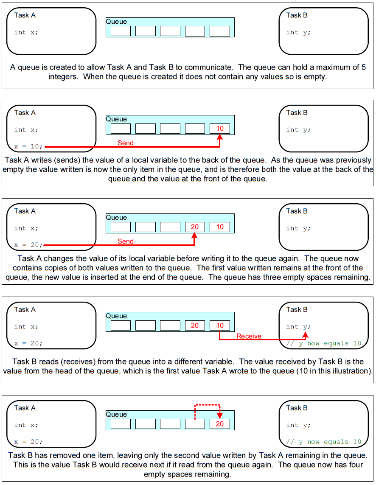

# 队列管理

## 章节介绍与范围

“队列” 提供了一个**任务到任务**，**任务到中断**和**中断到任务**的通讯机制。

### 范围

本章节的目标是告诉读者很好的理解：

* 如何创建队列。
* 一个队列是如何管理它所包含的数据。
* 如何发送数据到队列。
* 如何从队列接收数据。
* 阻塞队列意味着什么。
* 如何阻塞多个队列。
* 如何覆盖队列中的数据。
* 如何清除一个队列。
* 读取和写入一个队列对任务优先级的影响。

本章节只涵盖了任务到任务通讯。任务到中断与中断到任务通讯在第 6 章中说明。

## 队列的特征

### 数据存储

一个队列能保存有限数量的固定大小的数据单元。一个队列能保存单元的最大数量叫做 “长度”。每个队列数据单元的长度与大小是在创建队列时设置的。

队列通常是一个先入先出（FIFO）的缓冲区，即数据在队列末尾（tail）被写入，在队列前部（head）移出。图 31 展示了数据被写入和移出作为 FIFO 使用的队列。也可以写入队列的前端，并覆盖已位于队列前端的数据。

有两种方法可以实现队列的行为：

1. 通过复制实现队列：复制队列是指将发送到队列的数据一个字节一个字节地复制到队列中。
2. 通过引用实现队列：引用队列意味着队列只持有指向发送到队列的数据的指针，而不是数据本身。

FreeRTOS 是通过使用复制方法实现队列。这是考虑到复制队列比引用队列更强大，更容易使用，因为：

* 堆栈变量可以直接发送到队列，即使该变量将在声明它的函数退出后，不再存在。
* 可以将数据发送到队列，而无需先分配缓冲区来保存数据，然后将数据复制到分配的缓冲区中。
* 发送任务可以立即重用发送到队列的变量或缓冲区。
* 发送任务和接收任务是完全解耦的，应用程序设计人员不需要关心哪个任务拥有数据，或者哪个任务负责发布数据。
* 复制队列并不会阻止队列也被用于引用队列。例如，当正在排队的数据的大小使得将数据复制到队列不切实际时，可以将指向数据的指针复制到队列中。
* RTOS 完全负责分配用于存储数据的内存。
* 在受内存保护的系统中，任务可以访问的 RAM 将受到限制。在这种情况下，只有当发送和接收任务都可以访问存储数据的 RAM 时，才可以使用引用排队。按复制排队不受此限制；内核总是以完全特权运行，允许使用队列跨内存保护边界传递数据。

### 多任务访问

队列本身就是对象，任何知道它们存在的任务或 ISR 都可以访问它们。任意数量的任务可以写入同一个队列，任意数量的任务也可以从同一个队列读取。在实践中，队列有多个写入者是非常常见的，但是队列有多个读取者就不那么常见了。

### 阻塞队列读取

当任务尝试从队列中读取时，它可以选择指定 “阻塞” 时间。 如果队列已经为空，则这是任务将保持在阻塞状态以等待队列中的数据可用的时间。 当另一个任务或中断将数据放入队列时，处于阻塞状态且等待数据从队列中变为可用的任务将自动移至就绪状态。 如果指定的阻塞时间在数据可用之前到期，则任务也将自动从 “阻塞” 状态移动到 “就绪” 状态。

队列可以有多个读取者，因此单个队列可能会由多个在其上阻塞等待数据的任务。 在这种情况下，只有一个任务在数据可用时将被解除阻塞。 取消阻塞的任务始终是等待数据的最高优先级任务。 如果被阻塞的任务具有相同的优先级，那么等待数据最长的任务将被阻塞。

### 阻塞队列写入

与从队列读取数据时一样，任务也可以在向队列写入数据时指定阻塞时间。在这种情况下，如果队列已经满了，则阻塞时间是任务应该保持在阻塞状态以等待队列上可用空间的最长时间。

队列可以有多个写入者，因此对于一个完整的队列，可能有多个任务阻塞在队列上，等待完成发送操作。在这种情况下，当队列上的空间可用时，只有一个任务将被解除阻塞。未阻塞的任务总是等待空间的最高优先级任务。如果阻塞的任务具有相同的优先级，那么等待空间最长的任务将被解除阻塞。

### 阻塞多个队列

队列可被分组到集合中，允许任务进入阻塞状态来等待数据在集合的任何队列中变为可用。队列集合在第 4.6 章节 “从多个队列接收” 中展示。

## 使用队列

### xQueueCreate\(\) API 函数

一个队列在使用前必须被显式的创建。

队列被句柄引用，句柄是类型为 `QueueHandle_t` 类型的变量。`xQueueCreate()` API 函数会创建一个队列，并给一个 `QueueHandle_t` 的变量来引用这个被创建的队列。

FreeRTOS V9.0.0 也包含了 `xQueueCreateStatic()` 函数，它创建队列是在编译时静态地分配内存。当一个队列创建时，FreeRTOS 是从 FreeRTOS 堆中分配所需 RAM。这一段 RAM 被用来保存队列数据结构和队列所含的各个单元。`xQueueCreate()` 在创建队列所需 RAM 不足时会返回 `NULL` 。第 2 章提供了 FreeRTOS 堆的更多信息。

