# 任务管理

## 引言与范围

### 范围

本章旨在让读者更好地理解：

* FreeRTOS 如何为应用程序中的每个任务分配处理时间。
* FreeRTOS 如何选择在任何给定时间执行哪个任务。
* 每个任务的相对优先级如何影响系统行为。 
* 任何可以存在的任务。

读者也应该很好地理解：

* 如何实现任务。
* 如何创建一个或多个任务实例。
* 如何使用任务参数。
* 如何更改已被创建任务的优先级。
* 如何删除任务。
* 如何使用任务实现定期处理（软件计时器将在后面的章节中讨论）。
* 空闲任务何时执行以及如何使用。

本章介绍的概念对于理解如何使用 FreeRTOS 以及 FreeRTOS 应用程序的行为至关重要。因此，这是书中最详细的一章。

## 任务函数

任务为 C 函数实现。 它们唯一的特殊之处是它们的原型，它必须返回 `void` 并接受一个 `void` 指针参数。 清单 11 展示了原型。

```c
void ATaskFunction( void *pvParameters );
```

清单 11. 任务函数原型

每个任务本身都是一个小程序。 它有一个入口点，通常会在无限循环内永远运行，并且不会退出。 清单 12中显示了典型任务的结构。

FreeRTOS 任务不允许以任何方式从其实现的函数返回，即它们不能包含 `return` 语句，并且不能允许在函数结束之后执行。 如果不再需要任务，则应明确删除该任务。 这在清单 12 中也有说明。

单个任务函数，可被创建成任意数量的任务，每个创建的任务都是一个单独的执行实例，具有自己的堆栈以及在任务本身内定义的任何自动（堆栈）变量，都有自己的副本。

```c
void ATaskFunction( void *pvParameters )
{
/* 变量可以像普通函数一样声明。使用这个示例函数创建的任务的每个实例都有自己的 lVariableExample 
变量副本。如果将变量声明为静态，则不会出现这种情况，在这种情况下，只有一个变量副本存在，并且该副本
将由任务的每个创建实例共享。(添加到变量名的前缀在第1.5节“数据类型和编码风格指南”中进行了描述。) */
int32_t lVariableExample = 0;

    /* 任务通常将实现为无限循环。 */
    for( ;; )
    {
        /* 实现任务功能的代码将在此处。 */
    }

    /* 如果任务实现突破上述循环，则必须在到达其实现功能结束之前删除该任务。 传递给 vTaskDelete() 
    API 函数的 NULL 参数指示要删除的任务是调用（这个）任务。 用于命名 API 函数的约定在第 0 节中
    描述，使用早于 V9.0.0 的 FreeRTOS 版本的项目必须构建一个 heap_n.c 文件。 从 
    FreeRTOS V9.0.0 开始，只有在 FreeRTOSConfig.h 中将 configSUPPORT_DYNAMIC_ALLOCATION
    设置为 1 或者未定义 configSUPPORT_DYNAMIC_ALLOCATION 时才需要 heap_n.c 文件。 有关更多
    信息，请参阅第 2 章堆内存管理。 数据类型和编码风格指南。 */
    vTaskDelete( NULL );
}
```

清单 12. 典型任务函数的结构

## 顶层任务状态

应用程序可以包含许多任务。 如果运行应用程序的处理器是单核的，那么在任何给定时间只能执行一个任务。 这意味着任务可以存在两种状态：运行和未运行。 首先考虑这种简单化的模型，但请记住，这是一种过度简化。 在本章的后面，显示 “未运行” 状态实际上包含许多子状态。

当任务处于运行状态时，则处理器正在执行该任务的代码。 当任务处于 “未运行” 状态时，任务处于休眠状态，其状态已准备好，以便在下次调度程序确定应进入 “运行” 状态时继续执行。 当一个任务恢复执行时，它会从它上次离开运行状态之前执行的指令执行。


从 “未运行” 状态转换为 “运行” 状态的任务被称为 “已切入” 或 “已换入”。 相反，从 “运行” 状态转换到 “未运行” 状态的任务据说已被 “切出” 或 “换出”。 FreeRTOS 的调度程序是唯一可以切换任务的实体。

## 创建任务

### xTaskCreate\(\) API 函数

FreeRTOS V9.0.0 还包含 `xTaskCreateStatic()` 函数，它分配了在编译时静态创建任务所需的内存：任务是使用 FreeRTOS `xTaskCreate()` API 函数创建的。这可能是所有 API 函数中最复杂的一个，因此很不幸，它是第一个遇到的函数，但是必须首先掌握任务，因为它们是多任务系统中最基本的组件。本书附带的所有示例都使用了 `xTaskCreate()` 函数，因此有很多示例可供参考。

第 1.5 节 “数据类型和编程样式指南” 描述了所使用的数据类型和命名约定。

```c
BaseType_t xTaskCreate( TaskFunction_t pvTaskCode, 
                        const char* const pcName, 
                        uint16_t usStackDepth, 
                        void *pvParameters, 
                        UBaseType_t uxPriority, 
                        TaskHandle_t *pxCreatedTask );
```

清单 13. `xTaskCreate()` API 函数原型

表8. `xTaskCreate()` 参数和返回值

<table>
  <thead>
    <tr>
      <th style="text-align:left">&#x53C2;&#x6570;&#x540D;&#x79F0;/&#x8FD4;&#x56DE;&#x503C;</th>
      <th style="text-align:left">&#x63CF;&#x8FF0;</th>
    </tr>
  </thead>
  <tbody>
    <tr>
      <td style="text-align:left"><code>pvTaskCode</code>
      </td>
      <td style="text-align:left">&#x4EFB;&#x52A1;&#x4EC5;&#x4EC5;&#x662F;&#x4ECE;&#x4E0D;&#x9000;&#x51FA;&#x7684;C&#x51FD;&#x6570;&#xFF0C;&#x56E0;&#x6B64;&#x901A;&#x5E38;&#x4F5C;&#x4E3A;&#x65E0;&#x9650;&#x5FAA;&#x73AF;&#x6765;&#x5B9E;&#x73B0;&#x3002;<code>PvTaskCode</code>&#x53C2;&#x6570;&#x53EA;&#x662F;&#x6307;&#x5411;&#x5B9E;&#x73B0;&#x4EFB;&#x52A1;&#x7684;&#x51FD;&#x6570;&#x7684;&#x6307;&#x9488;(&#x5B9E;&#x9645;&#x4E0A;&#xFF0C;&#x53EA;&#x662F;&#x51FD;&#x6570;&#x7684;&#x540D;&#x79F0;)&#x3002;</td>
    </tr>
    <tr>
      <td style="text-align:left"><code>pcName</code>
      </td>
      <td style="text-align:left">&#x4EFB;&#x52A1;&#x7684;&#x63CF;&#x8FF0;&#x6027;&#x540D;&#x79F0;&#x3002;FreeRTOS&#x4E0D;&#x4F1A;&#x4EE5;&#x4EFB;&#x4F55;&#x65B9;&#x5F0F;&#x4F7F;&#x7528;&#x5B83;&#x3002;&#x5B83;&#x7EAF;&#x7CB9;&#x662F;&#x4F5C;&#x4E3A;&#x8C03;&#x8BD5;&#x8F85;&#x52A9;&#x5DE5;&#x5177;&#x800C;&#x5305;&#x542B;&#x7684;&#x3002;&#x901A;&#x8FC7;&#x4EBA;&#x7C7B;&#x53EF;&#x8BFB;&#x7684;&#x540D;&#x79F0;&#x6807;&#x8BC6;&#x4EFB;&#x52A1;&#x8981;&#x6BD4;&#x5C1D;&#x8BD5;&#x901A;&#x8FC7;&#x5176;&#x53E5;&#x67C4;&#x6807;&#x8BC6;&#x4EFB;&#x52A1;&#x7B80;&#x5355;&#x5F97;&#x591A;&#x3002;
        <br
        />
        <br />&#x5E94;&#x7528;&#x7A0B;&#x5E8F;&#x5B9A;&#x4E49;&#x7684;&#x5E38;&#x91CF;<code>configMAX_TASK_NAME_LEN</code>&#x5B9A;&#x4E49;&#x4E86;&#x4EFB;&#x52A1;&#x540D;&#x79F0;&#x53EF;&#x4EE5;&#x5305;&#x542B;&#x7684;&#x6700;&#x5927;&#x957F;&#x5EA6;-&#x5305;&#x62EC;&#x7A7A;&#x7EC8;&#x6B62;&#x7B26;&#x3002;&#x63D0;&#x4F9B;&#x957F;&#x5EA6;&#x8D85;&#x8FC7;&#x6B64;&#x6700;&#x5927;&#x503C;&#x7684;&#x5B57;&#x7B26;&#x4E32;&#x5C06;&#x5BFC;&#x81F4;&#x5B57;&#x7B26;&#x4E32;&#x88AB;&#x81EA;&#x52A8;&#x622A;&#x65AD;&#x3002;</td>
    </tr>
    <tr>
      <td style="text-align:left"><code>usStackDepth</code>
      </td>
      <td style="text-align:left">
        <p>&#x6BCF;&#x4E2A;&#x4EFB;&#x52A1;&#x90FD;&#x6709;&#x81EA;&#x5DF1;&#x7684;&#x552F;&#x4E00;&#x5806;&#x6808;&#xFF0C;&#x8BE5;&#x5806;&#x6808;&#x5728;&#x521B;&#x5EFA;&#x4EFB;&#x52A1;&#x65F6;&#x7531;&#x5185;&#x6838;&#x5206;&#x914D;&#x7ED9;&#x4EFB;&#x52A1;&#x3002; <code>usStackDepth</code>&#x503C;&#x544A;&#x8BC9;&#x5185;&#x6838;&#x5806;&#x6808;&#x7684;&#x5927;&#x5C0F;&#x3002;</p>
        <p></p>
        <p>&#x8BE5;&#x503C;&#x6307;&#x5B9A;&#x5806;&#x6808;&#x53EF;&#x4EE5;&#x5BB9;&#x7EB3;&#x7684;&#x5B57;&#x6570;&#xFF0C;&#x800C;&#x4E0D;&#x662F;&#x5B57;&#x8282;&#x6570;&#x3002;
          &#x4F8B;&#x5982;&#xFF0C;&#x5982;&#x679C;&#x5806;&#x6808;&#x662F; 32 &#x4F4D;&#x5BBD;&#x5E76;&#x4E14; <code>usStackDepth</code> &#x4F5C;&#x4E3A;
          100 &#x4F20;&#x5165;&#xFF0C;&#x5219;&#x5C06;&#x5206;&#x914D; 400 &#x5B57;&#x8282;&#x7684;&#x5806;&#x6808;&#x7A7A;&#x95F4;&#xFF08;100
          * 4 &#x5B57;&#x8282;&#xFF09;&#x3002; &#x5806;&#x6808;&#x6DF1;&#x5EA6;&#x4E58;&#x4EE5;&#x5806;&#x6808;&#x5BBD;&#x5EA6;&#x4E0D;&#x5F97;&#x8D85;&#x8FC7; <code>uint16_t</code> &#x7C7B;&#x578B;&#x7684;&#x53D8;&#x91CF;&#x4E2D;&#x53EF;&#x5305;&#x542B;&#x7684;&#x6700;&#x5927;&#x503C;&#x3002;
          <br
          />
        </p>
        <p>&#x7A7A;&#x95F2;&#x4EFB;&#x52A1;&#x4F7F;&#x7528;&#x7684;&#x5806;&#x6808;&#x5927;&#x5C0F;&#x7531;&#x5E94;&#x7528;&#x7A0B;&#x5E8F;&#x5B9A;&#x4E49;&#x7684;&#x5E38;&#x91CF; <code>configMINIMAL_STACK_SIZE</code>&#x5B9A;&#x4E49;&#x3002;&#x5728;
          FreeRTOS &#x6F14;&#x793A;&#x5E94;&#x7528;&#x7A0B;&#x5E8F;&#x4E2D;&#x4E3A;&#x6B63;&#x5728;&#x4F7F;&#x7528;&#x7684;&#x5904;&#x7406;&#x5668;&#x4F53;&#x7CFB;&#x7ED3;&#x6784;&#x5206;&#x914D;&#x7ED9;&#x6B64;&#x5E38;&#x91CF;&#x7684;&#x503C;&#x662F;&#x5EFA;&#x8BAE;&#x7684;&#x6700;&#x5C0F;&#x4EFB;&#x52A1;&#x3002;&#x5982;&#x679C;&#x60A8;&#x7684;&#x4EFB;&#x52A1;&#x4F7F;&#x7528;&#x5927;&#x91CF;&#x5806;&#x6808;&#x7A7A;&#x95F4;&#xFF0C;&#x5219;&#x5FC5;&#x987B;&#x5206;&#x914D;&#x66F4;&#x5927;&#x7684;&#x503C;&#x3002;
          <br
          />
          <br />
        </p>
        <p>&#x6CA1;&#x6709;&#x7B80;&#x5355;&#x7684;&#x65B9;&#x6CD5;&#x6765;&#x786E;&#x5B9A;&#x4EFB;&#x52A1;&#x6240;&#x9700;&#x7684;&#x5806;&#x6808;&#x7A7A;&#x95F4;&#x3002;&#x53EF;&#x4EE5;&#x8BA1;&#x7B97;&#xFF0C;&#x4F46;&#x662F;&#x5927;&#x591A;&#x6570;&#x7528;&#x6237;&#x53EA;&#x9700;&#x5206;&#x914D;&#x4ED6;&#x4EEC;&#x8BA4;&#x4E3A;&#x5408;&#x7406;&#x7684;&#x503C;&#xFF0C;&#x7136;&#x540E;&#x4F7F;&#x7528;FreeRTOS
          &#x63D0;&#x4F9B;&#x7684;&#x529F;&#x80FD;&#x6765;&#x786E;&#x4FDD;&#x5206;&#x914D;&#x7684;&#x7A7A;&#x95F4;&#x786E;&#x5B9E;&#x8DB3;&#x591F;&#xFF0C;&#x5E76;&#x4E14;RAM
          &#x4E0D;&#x4F1A;&#x88AB;&#x6D6A;&#x8D39;&#x3002; &#x7B2C; 12.3 &#x8282;&#x201C;&#x5806;&#x6808;&#x6EA2;&#x51FA;&#x201D;
          &#x5305;&#x542B;&#x6709;&#x5173;&#x5982;&#x4F55;&#x67E5;&#x8BE2;&#x4EFB;&#x52A1;&#x5B9E;&#x9645;&#x4F7F;&#x7528;&#x7684;&#x6700;&#x5927;&#x5806;&#x6808;&#x7A7A;&#x95F4;&#x7684;&#x4FE1;&#x606F;&#x3002;</p>
        <p></p>
      </td>
    </tr>
    <tr>
      <td style="text-align:left">
        <p></p>
        <p><code>pvParameters</code>
        </p>
      </td>
      <td style="text-align:left">&#x4EFB;&#x52A1;&#x51FD;&#x6570;&#x63A5;&#x53D7;&#x6307;&#x5411; <code>void</code>&#xFF08;<code>void *</code>&#xFF09;&#x7684;&#x7C7B;&#x578B;&#x6307;&#x9488;&#x7684;&#x53C2;&#x6570;&#x3002;&#x5206;&#x914D;&#x7ED9; <code>pvParameters</code> &#x7684;&#x503C;&#x662F;&#x4F20;&#x9012;&#x7ED9;&#x4EFB;&#x52A1;&#x7684;&#x503C;&#x3002;&#x672C;&#x4E66;&#x4E2D;&#x7684;&#x4E00;&#x4E9B;&#x793A;&#x4F8B;&#x6F14;&#x793A;&#x4E86;&#x5982;&#x4F55;&#x4F7F;&#x7528;&#x8BE5;&#x53C2;&#x6570;&#x3002;</td>
    </tr>
    <tr>
      <td style="text-align:left"><code>uxPriority</code>
      </td>
      <td style="text-align:left">
        <p>&#x5B9A;&#x4E49;&#x4EFB;&#x52A1;&#x6267;&#x884C;&#x7684;&#x4F18;&#x5148;&#x7EA7;&#x3002;&#x53EF;&#x4EE5;&#x5C06;&#x4F18;&#x5148;&#x7EA7;&#x4ECE;
          0&#xFF08;&#x6700;&#x4F4E;&#x4F18;&#x5148;&#x7EA7;&#xFF09;&#x5206;&#x914D;&#x7ED9;&#xFF08;<code>configMAX_PRIORITIES - 1</code>&#xFF09;&#xFF0C;&#x8FD9;&#x662F;&#x6700;&#x9AD8;&#x4F18;&#x5148;&#x7EA7;&#x3002; <code>configMAX_PRIORITIES</code> &#x662F;&#x7528;&#x6237;&#x5B9A;&#x4E49;&#x7684;&#x5E38;&#x91CF;&#xFF0C;&#x5728;3.5
          &#x8282;&#x4E2D;&#x63CF;&#x8FF0;&#x3002;
          <br />
        </p>
        <p>&#x4F20;&#x9012;&#x4E0A;&#x9762;&#x7684; <code>uxPriority</code> &#x503C;&#xFF08;<code>configMAX_PRIORITIES - 1</code>&#xFF09;&#x5C06;&#x5BFC;&#x81F4;&#x5206;&#x914D;&#x7ED9;&#x4EFB;&#x52A1;&#x7684;&#x4F18;&#x5148;&#x7EA7;&#x88AB;&#x9759;&#x9ED8;&#x9650;&#x5236;&#x4E3A;&#x6700;&#x5927;&#x5408;&#x6CD5;&#x503C;&#x3002;</p>
      </td>
    </tr>
    <tr>
      <td style="text-align:left"><code>pxCreatedTask</code>
      </td>
      <td style="text-align:left">
        <p><code>pxCreatedTask</code> &#x53EF;&#x7528;&#x4E8E;&#x4F20;&#x9012;&#x6B63;&#x5728;&#x521B;&#x5EFA;&#x7684;&#x4EFB;&#x52A1;&#x7684;&#x53E5;&#x67C4;&#x3002;&#x7136;&#x540E;&#xFF0C;&#x6B64;&#x53E5;&#x67C4;&#x53EF;&#x7528;&#x4E8E;&#x5F15;&#x7528;
          API &#x8C03;&#x7528;&#x4E2D;&#x7684;&#x4EFB;&#x52A1;&#xFF0C;&#x4F8B;&#x5982;&#xFF0C;&#x66F4;&#x6539;&#x4EFB;&#x52A1;&#x4F18;&#x5148;&#x7EA7;&#x6216;&#x5220;&#x9664;&#x4EFB;&#x52A1;&#x3002;
          <br
          />
        </p>
        <p>&#x5982;&#x679C;&#x60A8;&#x7684;&#x5E94;&#x7528;&#x7A0B;&#x5E8F;&#x6CA1;&#x6709;&#x4F7F;&#x7528;&#x4EFB;&#x52A1;&#x53E5;&#x67C4;&#xFF0C;&#x90A3;&#x4E48; <code>pxCreatedTask</code> &#x53EF;&#x4EE5;&#x8BBE;&#x7F6E;&#x4E3A; <code>NULL</code>&#x3002;</p>
      </td>
    </tr>
    <tr>
      <td style="text-align:left">&#x8FD4;&#x56DE;&#x503C;</td>
      <td style="text-align:left">
        <p>&#x6709;&#x4E24;&#x79CD;&#x53EF;&#x80FD;&#x7684;&#x8FD4;&#x56DE;&#x503C;&#xFF1A;</p>
        <p><code>pdPASS</code>&#xFF1A;&#x8FD9;&#x8868;&#x660E;&#x8BE5;&#x4EFB;&#x52A1;&#x5DF2;&#x6210;&#x529F;&#x521B;&#x5EFA;&#x3002;</p>
        <p><code>pdFAIL</code>&#xFF1A;&#x8FD9;&#x8868;&#x660E;&#x8BE5;&#x4EFB;&#x52A1;&#x5C1A;&#x672A;&#x521B;&#x5EFA;&#xFF0C;&#x56E0;&#x4E3A;
          FreeRTOS &#x53EF;&#x7528;&#x7684;&#x5806;&#x5185;&#x5B58;&#x4E0D;&#x8DB3;&#xFF0C;&#x65E0;&#x6CD5;&#x5206;&#x914D;&#x8DB3;&#x591F;&#x7684;
          RAM &#x6765;&#x4FDD;&#x5B58;&#x4EFB;&#x52A1;&#x6570;&#x636E;&#x7ED3;&#x6784;&#x548C;&#x5806;&#x6808;&#x3002;&#x7B2C;
          2 &#x7AE0;&#x63D0;&#x4F9B;&#x4E86;&#x6709;&#x5173;&#x5806;&#x5185;&#x5B58;&#x7BA1;&#x7406;&#x7684;&#x66F4;&#x591A;&#x4FE1;&#x606F;&#x3002;</p>
      </td>
    </tr>
  </tbody>
</table>


#### 示例 1. 创建任务

此示例演示了创建两个简单任务所需的步骤，然后启动执行的任务。 任务只是定期打印一个字符串，使用粗略的空循环来创建周期延迟。 这两个任务都以相同的优先级创建，除了打印出的字符串外，它们是相同的，参见清单 14 和清单 15 了解它们各自的实现。

```c
void vTask1( void *pvParameters )
{
const char *pcTaskName = "Task 1 is running\r\n";
volatile uint32_t ul; /* volatile 以确保 ul 没有优化。 */

    /* 对于大多数任务，都是在一个无限循环中实现的。 */
    for( ;; )
    {
        /* 打印出此任务的名称。 */
        vPrintString( pcTaskName );

        /* 延迟一段时间。 */
        for( ul = 0; ul < mainDELAY_LOOP_COUNT; ul++ )
        {
            /* 这个循环只是一个非常粗略的延迟实现。 这里没什么可做的。 
            后面的例子将以适当的延迟替换这个粗略的循环 */
        }
    }
}
```

清单 14. 实现示例 1 中使用的第一个任务

```c
void vTask2( void *pvParameters )
{
const char *pcTaskName = "Task 2 is running\r\n";
volatile uint32_t ul; /* volatile 以确保 ul 不被优化掉。 */

    /* 对于大多数任务，都是在一个无限循环中实现的。 */
    for( ;; )
    {
        /* 打印出此任务的名称。 */
        vPrintString( pcTaskName );

        /* 延迟一段时间。 */
        for( ul = 0; ul < mainDELAY_LOOP_COUNT; ul++ )
        {
            /* 这个循环只是一个非常粗略的延迟实现。 这里没什么可做的。 
            后面的例子将以适当的延迟替换这个粗略的循环 */
        }
    }
}
```

清单 15. 实现示例 1 中使用的第二个任务

`main()` 函数在启动调度程序之前创建任务，有关其实现请参见清单 16。

```c
int main( void )
{
    /* 创建两个任务之一。请注意，实际应用程序应该检查 xTaskCreate() 调用的返回值，以确保任务创建
    成功。 */
    xTaskCreate(    vTask1,  /* 指向实现任务的函数的指针。 */
                    "Task 1",/* 任务的文本名称。这只是为了方便调试。 */
                    1000,    /* 堆栈深度，小型微控制器将使用比这少得多的堆栈。 */
                    NULL,    /* 此示例不使用任务参数。 */
                    1,       /* 此任务将以优先级 1 运行。 */
                    NULL );  /* 此示例不使用任务句柄。 */

    /* 以完全相同的方式，以相同的优先级创建另一个任务。 */
    xTaskCreate(vTask2, "Task 2", 1000, NULL, 1, NULL );

    /* 启动调度程序，以便任务开始执行。 */
    vTaskStartScheduler();    

    /* 如果一切正常，那么 main() 将永远不会到达这里，因为调度程序将重新运行这些任务。如果 main() 
    确实到达这里，那么很可能没有足够的堆内存来创建空闲任务。第 2 章提供了关于堆内存管理的更多信息。 */
    for( ;; );
}
```

清单 16. 启动示例 1 任务

执行该示例将生成图 10 中所示的输出。


图 10 显示了两个似乎同时执行的任务; 但是，由于任务正在同一个处理器核上执行，但情况并非如此。 实际上，这两项任务都在迅速进入并退出运行状态。 这两个任务都以相同的优先级运行，因此在同一个处理器上运行共享时间。 实际执行模式如图 11 所示。

图 11 底部的箭头表示从时间 t1 开始经过的时间。 彩色线表示在每个时间点正在执行哪个任务，例如，Task1 在时间 t1 和时间 t2 之间执行。

任何时候只有一个任务可以处于运行状态。 因此，当一个任务进入运行状态（任务被切入）时，另一个任务进入非运行状态（任务被切出）。


示例 1 在启动调度程序之前，从 `main()` 内创建了两个任务。 从另一个任务中创建任务也是可能的。 例如，可以从 Task1 中创建 Task2，如清单 17 所示。

```c
void vTask1( void *pvParameters )
{
const char *pcTaskName = "Task 1 is running\r\n";
volatile uint32_t ul; /* volatile 确保 ul 没有被优化掉。 */

    /* 如果正在执行此任务代码，则必须已经启动了调度程序。在进入无限循环之前创建另一个任务。 */
    xTaskCreate( vTask2, "Task 2", 1000, NULL, 1, NULL );

    for( ;; )
    {
        /* 打印出此任务的名称。 */
        vPrintString( pcTaskName );

        /* 延迟一段时间。 */
        for( ul = 0; ul < mainDELAY_LOOP_COUNT; ul++ )
        {
            /* 这个循环只是一个非常粗略的延迟实现。 这里没什么可做的。 
            后面的例子将以适当的延迟替换这个粗略的循环 */
        }
    }
}
```

清单 17. 在调度程序启动后从另一个任务中创建任务

### 示例 2. 使用任务参数

在示例 1 中创建的两个任务是字面上的，它们之间的唯一区别是它们打印出来的文本字符串。 相反，可以通过创建单个任务实现的两个实例来删除此重复。 然后可以使用任务参数将要打印出的字符串传递给每个任务。

清单 18 包含示例 2 使用的单任务函数（`vTaskFunction`）的代码。此单个函数替换示例 1 中使用的两个任务函数（`vTask1` 和 `vTask2`）。注意如何将任务参数强制转换为 `char *` 以获取字符串任务 应打印出来。

```c
void vTaskFunction( void *pvParameters )
{
char *pcTaskName;
volatile uint32_t ul; /* volatile 以确保 ul 不被优化掉。 */

    /* 要打印的字符串通过参数传入。将此转换为字符指针。 */
    pcTaskName = ( char * ) pvParameters;

    /* 对于大多数任务，都是在一个无限循环中实现的。 */
    for( ;; )
    {
        /* 打印出此任务的名称。 */
        vPrintString( pcTaskName );

        /* 延迟一段时间。 */
        for( ul = 0; ul < mainDELAY_LOOP_COUNT; ul++ )
        {
            /* 这个循环只是一个非常粗略的延迟实现。 这里没什么可做的。 后来的练习将以适当的延迟取代这个原始循环 */
        }
    }
}
```

清单 18. 用于在示例 2 中创建两个任务的单个任务函数

即使现在只有一个任务实现（`vTaskFunction`），也可以创建多个已定义任务的实例。每个创建的实例将在 FreeRTOS 调度程序的控制下独立执行。

清单 19 显示了如何使用 `xTaskCreate()` 函数的 `pvParameters` 参数将文本字符串传递给任务。

```c
/* 定义将作为任务参数传入的字符串。它们定义为 const，不在堆栈上，以确保在执行任务时它们
仍然有效。 */
static const char *pcTextForTask1 = "Task 1 is running\r\n";
static const char *pcTextForTask2 = "Task 2 is running\r\n";

int main( void )
{
    /* 创建两个任务中的第一个。 */
    xTaskCreate(    vTaskFunction,         /* 指向实现该任务的函数的指针。 */
                    "Task 1",              /* 任务的文本名称。这只是为了方便调试。 */
                    1000,                  /* 堆栈深度 - 小型微控制器将使用比这少得多的堆栈。 */
                    (void*)pcTextForTask1, /* 使用任务参数将要打印的文本传递到任务中。 */
                    1,                     /* 这个任务将以优先级 1 运行。 */
                    NULL );                /* 本例中没有使用任务句柄。 */

    /* 用完全相同的方法创建另一个任务。注意，这一次将从同一个任务实现 (vTaskFunction) 
    创建多个任务。只有参数中传递的值不同。正在创建同一任务的两个实例。 */
    xTaskCreate( vTaskFunction, "Task 2", 1000, (void*)pcTextForTask2, 1, NULL );

    /* 启动调度程序，使任务开始执行。 */
    vTaskStartScheduler();    

    /* 如果一切正常，那么 main() 将永远不会到达这里，因为调度程序现在将运行这些任务。
    如果 main() 确实到达这里，那么很可能没有足够的堆内存来创建空闲任务。第 2 章提供了关于堆
    内存管理的更多信息。 */
    for( ;; );
}
```

清单 19. 示例 2 说使用的 `main()` 函数

示例 2 的输出完全与图 10 中的示例 1 所示的输出完全相同。

## 任务优先级

`xTaskCreate()` API 函数的 `uxPriority` 参数为正在创建的任务分配初始优先级。 使用`vTaskPrioritySet()` API 函数可以在启动调度程序后，更改优先级。

可用优先级的最大数量由应用程序设置，在 `FreeRTOSConfig.h` 中定义的 `configMAX_PRIORITIES` 编译时配置常量。 低数字优先级值表示低优先级任务，优先级 0 是可能的最低优先级。 因此，可用优先级的范围是 0 到（`configMAX_PRIORITIES - 1`）。任意数量的任务可以共享相同的优先级，确保最大的设计灵活性。

FreeRTOS 调度程序可以使用以下两种方法之一来确定哪个任务将处于运行状态。 可以设置 `configMAX_PRIORITIES` 的最大值取决于使用的方法：

1. 通用方法：通用方法在 C 中实现，可以与所有 FreeRTOS 架构移植一起使用。使用通用方法时，FreeRTOS 不会限制 `configMAX_PRIORITIES` 可以设置的最大值。 但是，始终建议将 `configMAX_PRIORITIES` 值保持在最小值，因为值越高，消耗的 RAM 越多，最坏情况下的执行时间就越长。如果在 `FreeRTOSConfig.h` 中将 `configUSE_PORT_OPTIMISED_TASK_SELECTION` 设置为 0，或者如果未定义 `configUSE_PORT_OPTIMISED_TASK_SELECTION`，或者如果通用方法是为使用的 FreeRTOS 移植提供的唯一方法，则将使用通用方法。
2. 架构优化方法：体系结构优化方法使用少量汇编代码，并且比通用方法更快。 `configMAX_PRIORITIES` 设置不会影响最坏情况执行时间。如果使用体系结构优化方法，那么`configMAX_PRIORITIES` 不能大于 32。与通用方法一样，建议将 `configMAX_PRIORITIES` 保持在必要的最小值，因为它的值越高，消耗的 RAM 就越多。如果在 `FreeRTOSConfig.h` 中将 `configUSE_PORT_OPTIMISED_TASK_SELECTION` 设置为 1，则将使用体系结构优化方法。并非所有 FreeRTOS 移植都提供了架构优化方法。

FreeRTOS 调度程序将始终确保能够运行的最高优先级任务是选择进入运行状态的任务。 如果能够运行多个具有相同优先级的任务，则调度程序将依次将每个任务转换为运行状态和退出运行状态。

## 时间测量和嘀嗒中断

第 3.12 节 “调度算法” 描述了一个名为 “时间切片” 的可选功能。 在目前给出的示例中使用了时间切片，它是在输出中观察到的行为。在示例中，两个任务都以相同的优先级创建，并且两个任务始终能够运行。 因此，每个任务为 “时间片” 执行，在时间片开始时进入运行状态，并在时间片结束时退出运行状态。 在图 11 中，t1 和 t2 之间的时间等于单个时间片。

为了能够选择要运行的下一个任务，调度程序本身必须在每个时间片的末尾执行。 称为 “滴答中断” 的周期性中断用于此目的。 时间片的长度由滴答中断频率有效设置，滴答中断频率由应用程序在 `FreeRTOSConfig.h` 中定义的 `configTICK_RATE_HZ` 编译时配置常量配置。 例如，如果 `configTICK_RATE_HZ` 设置为 100（Hz），则时间片将为 10 毫秒。 两次滴答中断之间的时间称为 “滴答期”。 一个时间片等于一个滴答时间段。

图 11 可以展开来显示调度程序本身在执行序列中的执行情况。图 12 显示了这一点，其中顶部一行显示了调度程序何时执行，细箭头显示了从任务到滴答中断的执行顺序，然后从滴答中断返回到另一个任务。

`configTICK_RATE_HZ` 的最佳值取决于正在开发的应用程序，但值通常为 100。

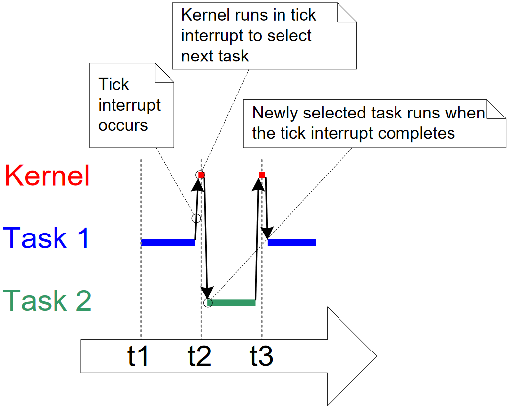

FreeRTOS API 调用总是以滴答周期的倍数指定时间，这通常被简单地称为滴答。`pdMS_TO_TICKS()` 宏将以毫秒为单位的时间转换为以节拍为单位的时间。可用的分辨率取决于所定义的滴答频率，如果滴答频率高于 1 KHz \(`configTICK RATE HZ` 大于 1000\)，则不能使用 `pdMS_TO_TICKS()`。清单 20 显示了如何使用 `pdMS_TO_TICKS()` 将指定为 200 毫秒的时间转换为以滴答为单位指定的等效时间。

```c
/* pdMS_TO_TICKS() 将以毫秒为单位的时间作为其唯一参数，并计算滴答周期中的等效时间。 
此示例显示 xTimeInTicks 设置为等于 200 毫秒的滴答周期数。 */
TickType_t xTimeInTicks = pdMS_TO_TICKS( 200 );
```

清单 20. 使用pdMS TO TICKS\(\)宏将200毫秒转换为滴答周期中的等效时间


不建议在应用程序中直接以滴答为单位指定时间，而是使用 `pdMS_TO_TICKS()`宏来指定以毫秒为单位的时间，这样做可以确保如果滴答频率发生变化，应用程序中指定的时间不会发生变化。


滴答计数值是调度器启动以来发生的滴答中断总数，假设滴答计数没有溢出。在指定延迟周期时，用户应用程序不必考虑溢出，因为时间一致性是由 FreeRTOS 在内部管理的。

第 3.12 节 “调度算法” 描述了影响调度程序何时选择要运行的新任务以及何时执行勾选中断的配置常量。

### 示例 3. 使用优先级进行实验

调度程序将始终确保能够运行的最高优先级任务是选择进入 “运行” 状态的任务。 在我们到目前为止的示例中，已经以相同的优先级创建了两个任务，因此他们是依次进入和退出运行状态。 此示例查看在更改示例 2 中创建的两个任务之一时的优先级。 这次，第一个任务将以优先级 1 创建，第二个任务将以优先级 2 创建。创建任务的代码如清单 21 所示。实现这两个任务的单个函数没有改变。 它仍然只是定期打印出一个字符串，使用空循环来创建延迟。

```c
/* 定义将作为任务参数传入的字符串。 这些是定义的const而不是堆栈，以确保它们在任务执行时保持有效。 */
static const char *pcTextForTask1 = "Task 1 is running\r\n";
static const char *pcTextForTask2 = "Task 2 is running\r\n";

int main( void )
{
    /* Create the first task at priority 1.  The priority is the second to last parameter. */
    xTaskCreate( vTaskFunction, "Task 1", 1000, (void*)pcTextForTask1, 1, NULL );

    /* 以优先级 2 创建第二个任务，优先级高于优先级 1。优先级是倒数第二个参数。 */
    xTaskCreate( vTaskFunction, "Task 2", 1000, (void*)pcTextForTask2, 2, NULL );

    /* 启动调度程序，以便任务开始执行。 */
    vTaskStartScheduler();    

    /* 不会到达这里。 */
    return 0;
}
```

清单 21. 以不同的优先级创建两个任务

示例 3 产生的输出如图 13 所示。 调度程序将始终选择能够运行的最高优先级任务。 任务 2 的优先级高于任务 1，并且始终能够运行；因此，任务 2 是唯一进入运行状态的任务。 若任务 1 从未进入运行状态，它永远不会打印出它的字符串。 任务 1 被称为任务 2 的处理时间 “缺乏”。

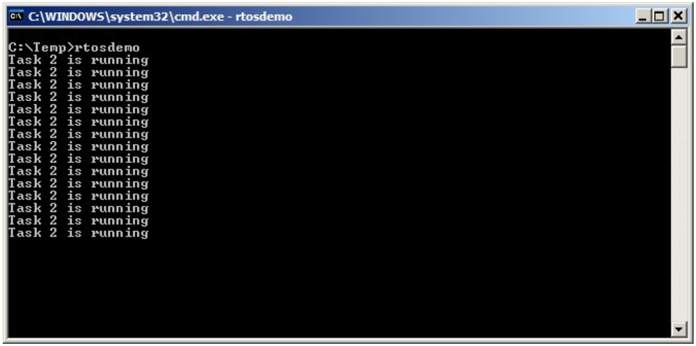

任务 2 总是能够运行，因为它永远不必等待任何事情 —— 它要么循环一个空循环，要么打印到终端。

图 14 显示了示例 3 的执行顺序。

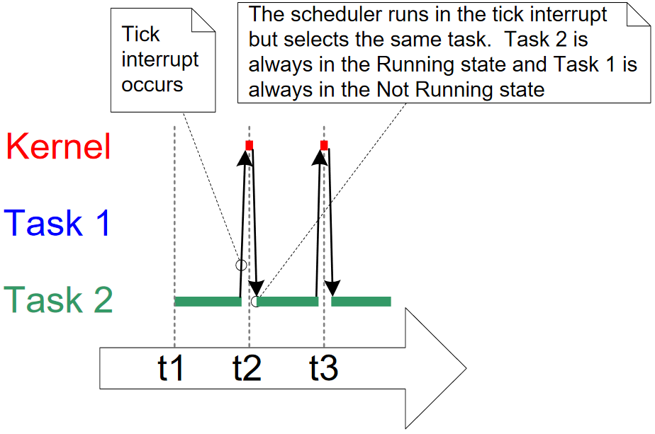

## 展开说 “非运行” 状态

到目前为止，创建的任务总是有执行处理，从来没有等待任何事情，因为他们永远不必等待任何事情，他们总是能够进入运行状态。 这种类型的 “连续处理” 任务的有用性有限，因为它们只能以最低优先级创建。 如果它们以任何其他优先级运行，它们将阻止具有较低优先级的任务一直运行。

为了使任务有用，必须重写它们以使其成为事件驱动的。 事件驱动的任务只有在触发它的事件发生后才能执行工作（处理），并且在该事件发生之前无法进入运行状态。 调度程序始终选择能够运行的最高优先级任务。 无法运行的高优先级任务意味着调度程序无法选择它们，而必须选择能够运行的优先级较低的任务。 因此，使用事件驱动任务意味着可以在不同的优先级上创建任务，而不需要最高优先级的任务占用所有较低优先级的任务的处理时间。

### 阻塞状态

正在等待事件的任务被称为处于阻塞状态，这是未运行状态的子状态。

任务可以进入阻塞状态，等待两种不同类型的事件：

1. 时间（与时间相关）事件，即该事件是延时期到期或达到绝对时间。 例如，任务可以进入阻塞状态以等待10毫秒再通过。
2. 同步事件，即该事件源自另一个任务或中断。 例如，任务可以进入阻塞状态以等待数据到达队列。 同步事件涉及广泛的事件类型。

FreeRTOS 的队列，二进制信号量，计数信号量，互斥量，递归互斥体，事件组和直接到任务通知都可用于创建同步事件。 所有这些功能都将在本书的后续章节中介绍。

任务可以在阻塞时设置带有超时的同步事件，同时有效地阻塞两种类型的事件。 例如，任务可以选择等待最多 10 毫秒的数据到达队列。 如果数据在 10 毫秒内到达，或者在没有数据到达的情况下传递 10 毫秒，任务都将离开阻塞状态。

### 挂起状态

“挂起” 也是非运行状态的子状态。 处于挂起状态的任务对调度程序时不可用的。 进入挂起状态的唯一方法是通过调用 `vTaskSuspend()`API函数，调用 `vTaskResume()` 或 `xTaskResumeFromISR()` API 函数时退出挂起的唯一出路。 大多数应用程序不使用挂起状态。

### 就绪状态

处于 “未运行” 状态但未被阻塞或挂起的任务被称为处于 “就绪” 状态。 它们能够运行，因此 “准备好” 运行，但当前不处于 “运行” 状态。

### 完成状态转换图

图 15 展开了先前过度简化的状态图，以包括本节中描述的所有非运行状态的子状态。 到目前为止，在示例中创建的任务没有使用阻塞或挂起状态；它们只在就绪状态和运行状态之间转换，由图 15 中的粗线突出显示。

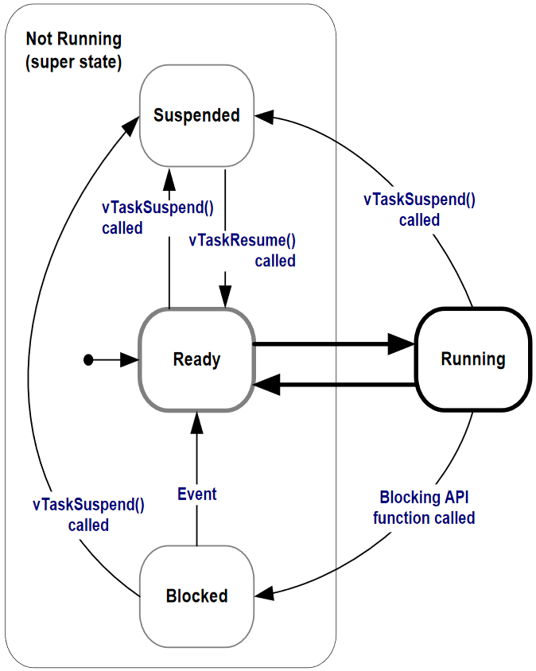

示例 4. 使用 “阻止” 状态创建延迟

到目前为止，在示例中创建的所有任务都是 “周期性的”，它们已经延迟了一段时间并打印出它们的字符串，然后再次延迟，依此类推。使用空循环非常粗略地生成延迟，该任务有效地轮询递增循环计数器，直到它达到固定值。实施例 3 清楚地证明了该方法的缺点。优先级较高的任务在执行空循环时保持运行状态，“饿死” 任何处理时间的优先级较低的任务。

任何形式的轮询还有其他几个缺点，其中最重要的是它的效率低下。在轮询期间，该任务实际上没有任何工作要做，但它仍然使用最长的处理时间，因此浪费了处理器的资源。示例 4 通过调用 `vTaskDelay()` API 函数替换轮询空循环来纠正此行为，其原型如清单 22 所示。新的任务定义如清单 23 所示。请注意，`vTaskDelay()` API 函数是仅当 `FreeRTOSConfig.h` 中的 `INCLUDE_vTaskDelay` 设置为 1 时才可用。

`vTaskDelay()` 将调用任务置于阻塞状态，以获得固定数量的滴答中断。任务在处于阻塞状态时不使用任何处理时间，因此任务仅在实际工作时使用处理时间。

```c
void vTaskDelay( TickType_txTicksToDelay );
```

清单 22. `vTaskDelay()` 的函数原型

表 9. `vTaskDelay()` 参数

<table>
  <thead>
    <tr>
      <th style="text-align:left">&#x53C2;&#x6570;&#x540D;&#x79F0;</th>
      <th style="text-align:left">&#x63CF;&#x8FF0;</th>
    </tr>
  </thead>
  <tbody>
    <tr>
      <td style="text-align:left"><code>xTicksToDelay</code>
      </td>
      <td style="text-align:left">
        <p>&#x8C03;&#x7528;&#x4EFB;&#x52A1;&#x5728;&#x8F6C;&#x6362;&#x56DE;&#x5C31;&#x7EEA;&#x72B6;&#x6001;&#x4E4B;&#x524D;&#x5C06;&#x4FDD;&#x6301;&#x5728;&#x963B;&#x585E;&#x72B6;&#x6001;&#x7684;&#x6EF4;&#x7B54;&#x4E2D;&#x65AD;&#x6570;&#x3002;</p>
        <p>&#x4F8B;&#x5982;&#xFF0C;&#x5982;&#x679C;&#x4E00;&#x4E2A;&#x540D;&#x4E3A; <code>vTaskDelay(100)</code> &#x7684;&#x4EFB;&#x52A1;&#x5728;&#x6EF4;&#x7B54;&#x8BA1;&#x6570;&#x4E3A; <code>10,000</code> &#x65F6;&#x7ACB;&#x5373;&#x8FDB;&#x5165;&#x963B;&#x585E;&#x72B6;&#x6001;&#xFF0C;&#x5E76;&#x4FDD;&#x6301;&#x963B;&#x585E;&#x72B6;&#x6001;&#xFF0C;&#x76F4;&#x5230;&#x6EF4;&#x7B54;&#x8BA1;&#x6570;&#x8FBE;&#x5230; <code>10,100</code>&#x3002;&#x53EF;&#x4EE5;&#x4F7F;&#x7528;&#x5B8F; <code>pdMS_TO_TICKS()</code> &#x5C06;&#x4EE5;&#x6BEB;&#x79D2;&#x4E3A;&#x5355;&#x4F4D;&#x7684;&#x65F6;&#x95F4;&#x8F6C;&#x6362;&#x4E3A;&#x4EE5;
          int &#x4E3A;&#x5355;&#x4F4D;&#x7684;&#x65F6;&#x95F4;&#x3002;&#x4F8B;&#x5982;&#xFF0C;&#x8C03;&#x7528; <code>vTaskDelay(pdMS_TO_TICKS(100))</code> &#x5C06;&#x5BFC;&#x81F4;&#x8C03;&#x7528;&#x4EFB;&#x52A1;&#x4FDD;&#x6301;&#x963B;&#x585E;&#x72B6;&#x6001;
          100 &#x6BEB;&#x79D2;&#x3002;</p>
      </td>
    </tr>
  </tbody>
</table>

```c
void vTaskFunction( void *pvParameters ) 
{ 
char *pcTaskName; 
const TickType_t xDelay250ms = pdMS_TO_TICKS( 250 );

    /* 要打印的字符串通过参数传入。将此转换为字符指针。 */
    pcTaskName = ( char * ) pvParameters;

    /* 对于大多数任务，都是在一个无限循环中实现的。 */
    for( ;; )
    {
        /* 打印出此任务的名称。 */
        vPrintString( pcTaskName );

        /* 延迟一段时间。 这次调用 vTaskDelay() 会将任务置于阻塞状态，直到延迟时间结束。
        参数需要 'ticks' 中指定的时间，并使用 pdMS_TO_TICKS() 宏（声明 xDelay250ms 
        常量）将 250 毫秒转换为滴答的等效时间。*/
        vTaskDelay( xDelay250ms );
    }
}
```

清单 23. 空循环延迟的示例任务的源代码已被对 `vTaskDelay()`的调用所取代

尽管这两项任务仍在不同的优先级下创建，但现在都将运行。 示例 4 的输出（如图 16 所示）确认了预期的行为。

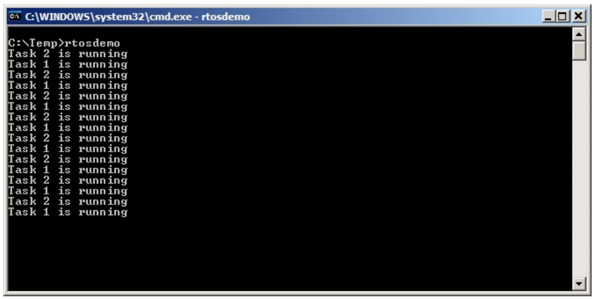

图 17 中显示的执行顺序解释了为什么两个任务都运行，即使它们是以不同的优先级创建的。 为简单起见，省略了调度程序本身的执行。

在启动调度程序时自动创建空闲任务，以确保始终有至少一个任务能够运行 \(至少一个处于就绪状态的任务\)。第 3.8 节，空闲任务和空闲任务钩子，更详细地描述了空闲任务。

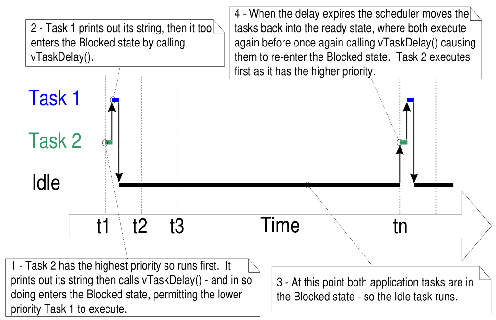

这两个任务的实现发生了变化，没有改变它们的功能。将图 17 与图 12 进行比较，可以清楚地看到，实现此功能的方式要有效得多。

图 12 显示了当任务使用空循环来创建延迟时的执行模式——始终运行，因此使用它们之间可用处理器时间的百分之百。 图 17 显示了任务在整个延迟期间进入阻塞状态时的执行模式，因此只有在实际需要执行工作时才使用处理器时间（在这种情况下只是要打印出来的消息），并且结果只使用可用处理时间的一小部分。

在图 17 的场景中，每当任务离开阻塞状态时，它们会在重新进入阻塞状态之前执行一小部分时间。 大多数情况下，没有能够运行的应用程序任务（就绪状态下没有应用程序任务），因此，没有可以选择进入运行状态的应用程序任务。 在这种情况下，空闲任务将运行。 分配给空闲的处理时间量是系统中备用处理能力的度量。使用 RTOS 可以简单地通过允许应用程序完全由事件驱动来显着增加备用处理能力。

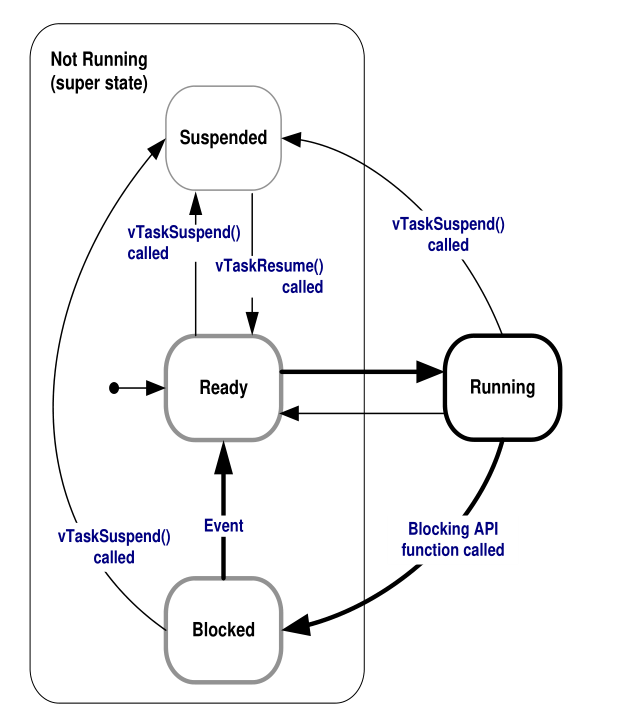

图 18 中的粗线显示了示例 4 中的任务执行的转换，每个转换现在都转换到阻塞状态，然后返回到就绪状态。

#### vTaskDelayUntil\(\) API 函数

`vTaskDelayUntil()` 类似于 `vTaskDelay()`。 正如刚才演示的，`vTaskDelay()` 参数指定了调用`vTaskDelay()` 的任务与再次从阻塞状态过渡到正常状态的任务之间应该发生的滴动中断的数量。任务处于阻塞状态的时间长度由 `vTaskDelay()` 参数指定，但是任务离开阻塞状态的时间与调用 `vTaskDelay()` 的时间相关。

相反，`vTaskDelayUntil()` 的参数指定调用任务应该从阻塞状态移动到就绪状态的精确计时计数值。`vTaskDelayUntil()` 是在需要固定执行期间（您希望任务以固定频率定期执行）时应使用的 API 函数，因为调用任务被解除阻塞的时间是绝对的，而不是相对于调用函数时（与 `vTaskDelay()` 的情况一样）。

```c
void vTaskDelayUntil( TickType_t* pxPreviousWakeTime, TickType_t xTimeIncrement );
```

清单 24. `vTaskDelayUntil()` API 函数原型

表 10. `vTaskDelayUntil()` 的参数


| 参数名称 | 描述 |
| :--- | :--- |


<table>
  <thead>
    <tr>
      <th style="text-align:left">pxPreviousWakeTime</th>
      <th style="text-align:left">
        <p>&#x6B64;&#x53C2;&#x6570;&#x7684;&#x547D;&#x540D;&#x662F;&#x57FA;&#x4E8E; <code>vTaskDelayUntil()</code> &#x7528;&#x4E8E;&#x5B9E;&#x73B0;&#x5B9A;&#x671F;&#x6267;&#x884C;&#x4E14;&#x5177;&#x6709;&#x56FA;&#x5B9A;&#x9891;&#x7387;&#x7684;&#x4EFB;&#x52A1;&#x3002;
          &#x5728;&#x8FD9;&#x79CD;&#x60C5;&#x51B5;&#x4E0B;&#xFF0C;<code>pxPreviousWakeTime</code> &#x4FDD;&#x6301;&#x4EFB;&#x52A1;&#x6700;&#x540E;&#x4E00;&#x6B21;&#x79BB;&#x5F00;&#x963B;&#x585E;&#x72B6;&#x6001;&#x7684;&#x65F6;&#x95F4;&#xFF08;&#x88AB;
          &apos;&#x5524;&#x9192;&apos;&#xFF09;&#x3002; &#x6B64;&#x65F6;&#x95F4;&#x7528;&#x4F5C;&#x53C2;&#x8003;&#x70B9;&#xFF0C;&#x7528;&#x4E8E;&#x8BA1;&#x7B97;&#x4EFB;&#x52A1;&#x4E0B;&#x6B21;&#x79BB;&#x5F00;&#x963B;&#x585E;&#x72B6;&#x6001;&#x7684;&#x65F6;&#x95F4;&#x3002;</p>
        <p><code>pxPreviousWakeTime</code> &#x6307;&#x5411;&#x7684;&#x53D8;&#x91CF;&#x5728; <code>vTaskDelayUntil()</code>&#x51FD;&#x6570;&#x4E2D;&#x81EA;&#x52A8;&#x66F4;&#x65B0;&#xFF1B;&#x5B83;&#x901A;&#x5E38;&#x4E0D;&#x4F1A;&#x88AB;&#x5E94;&#x7528;&#x7A0B;&#x5E8F;&#x4EE3;&#x7801;&#x4FEE;&#x6539;&#xFF0C;&#x4F46;&#x5FC5;&#x987B;&#x5728;&#x7B2C;&#x4E00;&#x6B21;&#x4F7F;&#x7528;&#x4E4B;&#x524D;&#x521D;&#x59CB;&#x5316;&#x4E3A;&#x5F53;&#x524D;&#x7684;&#x6EF4;&#x7B54;&#x8BA1;&#x6570;&#x3002;
          &#x6E05;&#x5355; 25 &#x6F14;&#x793A;&#x4E86;&#x5982;&#x4F55;&#x6267;&#x884C;&#x521D;&#x59CB;&#x5316;&#x3002;</p>
      </th>
    </tr>
  </thead>
  <tbody></tbody>
</table>

<table>
  <thead>
    <tr>
      <th style="text-align:left">xTimeIncrement</th>
      <th style="text-align:left">
        <p>&#x6B64;&#x53C2;&#x6570;&#x7684;&#x547D;&#x540D;&#x4E5F;&#x662F;&#x57FA;&#x4E8E; <code>vTaskDelayUntil()</code> &#x7528;&#x4E8E;&#x5B9E;&#x73B0;&#x5B9A;&#x671F;&#x6267;&#x884C;&#x4E14;&#x5177;&#x6709;&#x56FA;&#x5B9A;&#x9891;&#x7387;&#x7684;&#x4EFB;&#x52A1;&#xFF0C;&#x9891;&#x7387;&#x7531; <code>xTimeIncrement</code> &#x503C;&#x8BBE;&#x7F6E;&#x3002;</p>
        <p><code>xTimeIncrement</code> &#x5728; &apos;ticks&apos; &#x4E2D;&#x6307;&#x5B9A;&#x3002; <code>pdMS_TO_TICKS()</code>&#x5B8F;&#x53EF;&#x7528;&#x4E8E;&#x5C06;&#x6BEB;&#x79D2;&#x6307;&#x5B9A;&#x7684;&#x65F6;&#x95F4;&#x8F6C;&#x6362;&#x4E3A;&#x523B;&#x5EA6;&#x4E2D;&#x6307;&#x5B9A;&#x7684;&#x65F6;&#x95F4;&#x3002;</p>
      </th>
    </tr>
  </thead>
  <tbody></tbody>
</table>

示例 4 中创建的两个任务是周期性任务，但是使用 `vTaskDelay()` 并不保证它们运行的频率是固定的，因为任务离开阻塞状态的时间与它们调用 `vTaskDelay()` 的时间相关。 将任务转换为使用`vTaskDelayUntil()` 而不是 `vTaskDelay()` 可以解决这个潜在的问题。

```c
void vTaskFunction( void *pvParameters )
{
char *pcTaskName;
TickType_t xLastWakeTime;

    /* 要打印的字符串通过参数传入。将此转换为字符指针。 */
    pcTaskName = ( char * ) pvParameters;

    /* 需要使用当前滴针计数初始化 xLastWakeTime 变量。注意，这是唯一一次显式地写入变量。
    在此之后，xLastWakeTime 将在 vTaskDelayUntil() 中自动更新。 */
    xLastWakeTime = xTaskGetTickCount();

    /* 对于大多数任务，都是在一个无限循环中实现的。 */
    for( ;; )
    {
        /* 打印出此任务的名称。 */
        vPrintString( pcTaskName );

        /* 这个任务应该精确地每 250 毫秒执行一次。根据 vTaskDelay() 函数，时间是以滴答为
        单位度量的，pdMS_TO_TICKS() 宏用于将毫秒转换为滴答。xLastWakeTime 在 
        vTaskDelayUntil() 中自动更新，因此任务不会显式地更新 xLastWakeTime。 */
        vTaskDelayUntil( &xLastWakeTime, pdMS_TO_TICKS( 250 ));
    }
}
```

清单 25. 使用 `vTaskDelayUntil()` 实现示例任务

示例 5 产生的输出与图 16 中的示例 4 所示的输出完全相同。

### 示例 6. 组合阻塞和非阻塞任务

前面的示例已经单独检查了轮询和阻塞任务的行为。 该示例通过在组合两个方案时演示执行序列来重新强制执行所述的预期系统行为，如下所述。

1. 在优先级 1 创建两个任务。除了连续打印字符串之外，它们什么也不做。这些任务从不执行任何可能导致它们进入阻塞状态的 API 函数调用，因此总是处于就绪状态或运行状态。这种性质的任务称为连续处理任务，因为它们总是有工作要做\(尽管在本例中是相当琐碎的工作\)。连续处理任务的源如清单 26 所示。
2. 然后在优先级 2 创建第三个任务，因此高于其他两个任务的优先级。第三个任务也只是打印出一个字符串，但这次是周期性的，所以使用 `vTaskDelayUntil()` API 函数在每次打印迭代之间将自己置于阻塞状态。

这个周期性任务的源代码如清单 27 所示。

```c
void vContinuousProcessingTask( void *pvParameters )
{
char *pcTaskName;

    /* 要打印的字符串通过参数传入。将此转换为字符指针。 */
    pcTaskName = ( char * ) pvParameters;

    /* 对于大多数任务，都务是在一个无限循环中实现的。 */
    for( ;; )
    {
        /* 打印出此任务的名称。这个任务只是重复地做这件事，从不阻塞或延迟。 */
        vPrintString( pcTaskName );
    }
}
```

清单 26. 示例 6 中使用的连续处理任务

```c
void vPeriodicTask( void *pvParameters )
{
TickType_t xLastWakeTime;
const TickType_t xDelay3ms = pdMS_TO_TICKS( 3 );

    /* 需要使用当前滴针计数初始化 xLastWakeTime 变量。注意，这是唯一一次显式地写入变量。
    在此之后，xLastWakeTime 由 vTaskDelayUntil() API 函数自动管理。 */
    xLastWakeTime = xTaskGetTickCount();

    /* 对于大多数任务，都务是在一个无限循环中实现的。 */
    for( ;; )
    {
        /* 打印出此任务的名称。 */
        vPrintString( "Periodic task is running\r\n" );

        /* 任务应该每 3 毫秒执行一次，在这个函数中可以看到 xDelay3ms 的声明。 */
        vTaskDelayUntil( &xLastWakeTime, xDelay3ms);
    }
}
```

清单 27. 示例 6 中使用的周期性任务

图 19 显示了示例 6 生成的输出，并通过图 20 中所示的执行顺序解释了观察到的行为。

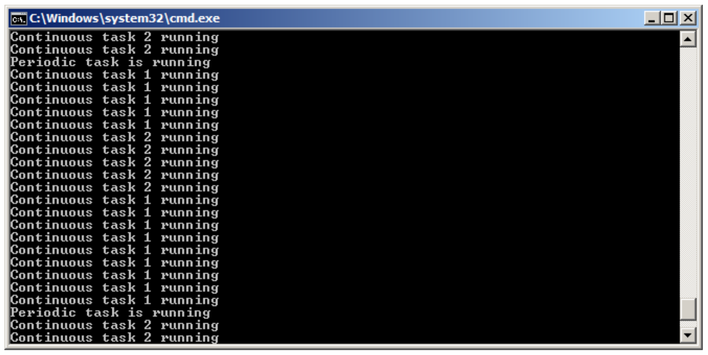

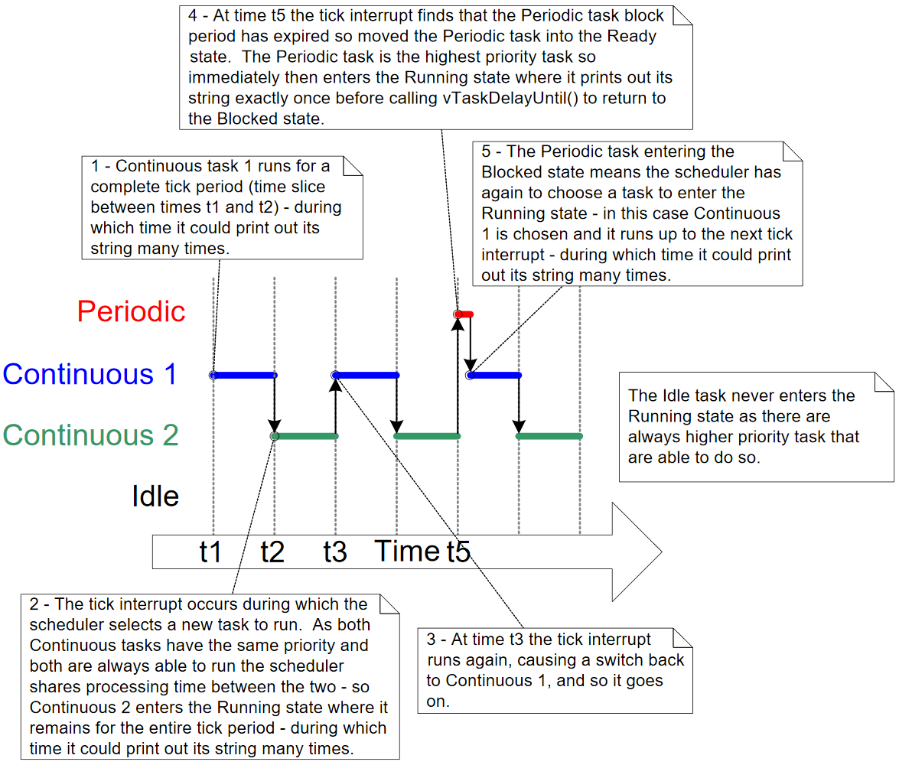

## 空闲任务和空闲任务钩子

示例 4 中创建的任务将大部分时间用于阻塞状态。在此状态下，它们无法运行，因此调度程序也无法选择它们。

但必须始终至少有一个任务可以进入运行状态。 为确保这种情况，调用 `vTaskStartScheduler()` 时，调度程序会自动创建一个空闲任务。 空闲任务只是坐在一个循环中 —— 所以，就像原始第一个例子中的任务一样，它始终能够运行。

空闲任务具有可能的最低优先级（优先级为零），以确保它永远不会阻止更高优先级的应用程序任务进入运行状态 —— 尽管没有什么可以阻止应用程序设计者创建任务，从而共享空闲任务优先级，如果在`FreeRTOSConfig.h` 中，`configIDLE_SHOULD_YIELD` 编译时间配置常量可用于防止空闲任务消耗更高效地分配给应用程序任务的处理时间。 `configIDLE_SHOULD_YIELD` 在第 3.12 节 “调度算法” 中描述。

以最低优先级运行可确保只要优先级较高的任务进入就绪状态，空闲任务就会从运行状态转移出来。 这可以在图 17 中的时间点看到，其中空闲任务被立即换出以允许任务 2 在任务 2 离开被阻止状态的瞬间执行。 据说任务 2 已经抢占了空闲任务。 抢先自动发生，并且不知道任务被抢占。


如果应用程序使用 `vTaskDelete()` API 函数，那么空闲任务就不会浪费处理时间。这是因为空闲任务负责在删除任务之后清理内核资源。


### 空闲任务钩子函数

可以通过使用空闲钩子（或空闲回调）函数将应用程序特定功能直接添加到空闲任务中 —— 空闲任务循环每次迭代时由空闲任务自动调用的函数。

空闲任务钩子的常见用途包括：

* 执行低优先级，后台或连续处理功能。
* 测量备用处理能力的数量。（当所有优先级较高的应用程序任务无法执行时，空闲任务将会运行；因此，测量分配给空闲任务的处理时间量可清楚地指示多少处理时间。）
* 将处理器置于低功耗模式，在没有应用处理的情况下提供简单且自动的省电方法（虽然使用这种方法所能达到的省电比使用第 10 章低功耗支持中描述的无时钟空闲模式所能达到的省电要少）。

### 对空闲任务钩子函数实现的限制

空闲任务钩子函数必须遵循以下规则。

1. 一个空闲的任务钩子函数决不能试图阻塞或挂起。
2. 如果应用程序使用了 `vTaskDelete()` API函数，那么空闲任务钩子必须总是在合理的时间段内返回给调用者。这是因为空闲任务负责在删除任务之后清理内核资源。如果空闲任务永久地保留在空闲钩子函数中，则无法进行清理。


以任何方式阻塞空闲任务都可能导致无法使用任何任务进入运行状态。


空闲任务钩子函数必须具有清单 28 所示的名称和原型。

```c
void vApplicationIdleHook( void );
```

清单 28. 空闲任务钩子函数名称和原型

### 示例 7. 定义空闲任务钩子功能

在执行空闲任务时，使用示例 4 中的阻塞 `vTaskDelay()` API调用会创建大量空闲时间，因为两个应用程序任务都处于阻塞状态。 示例 7 通过添加空闲挂钩函数来利用此空闲时间，其源代码如清单 29 所示。

```c
/* 声明一个将由钩子函数递增的变量。 */
volatile uint32_tulIdleCycleCount = 0UL;

/* 空闲钩子函数必须被称为 vApplicationIdleHook()，不带参数，并返回 void。 */
void vApplicationIdleHook( void )
{
    /* 这个钩子函数除了递增计数器外什么都不做。 */
    ulIdleCycleCount++;
}
```

清单 29. 一个非常简单的空闲钩子函数

`config_IDLE_HOOK` 必须在 `FreeRTOSConfig.h` 设置为 1 ，以便调用空闲钩子函数。

稍微修改实现创建任务的函数以打印出 `ulIdleCycleCount` 值，如清单 30 所示。

```c
void vTaskFunction( void *pvParameters )
{
char *pcTaskName;
const TickType_t xDelay250ms = pdMS_TO_TICKS( 250 );

    /* 要打印的字符串通过参数传入。将此转换为字符指针。 */
    pcTaskName = ( char * ) pvParameters;

    /* 与大多数任务一样，此任务在无限循环中实现。 */
    for( ;; )
    {
        /* 打印出此任务的名称，并加入 ulIdleCycleCount 的次数。 */
        vPrintStringAndNumber( pcTaskName, ulIdleCycleCount);

        /* 延迟 250 毫秒。 */
        vTaskDelay( xDelay250ms);
    }
}
```

清单 30. 示例任务的源代码现在打印出 `ulIdleCycleCount` 值

示例 7 产生的输出如图 21 所示。 因此，在应用任务的每次迭代之间，空闲任务钩子函数被调用大约 400 万次（迭代次数取决于演示执行的硬件的速度）。

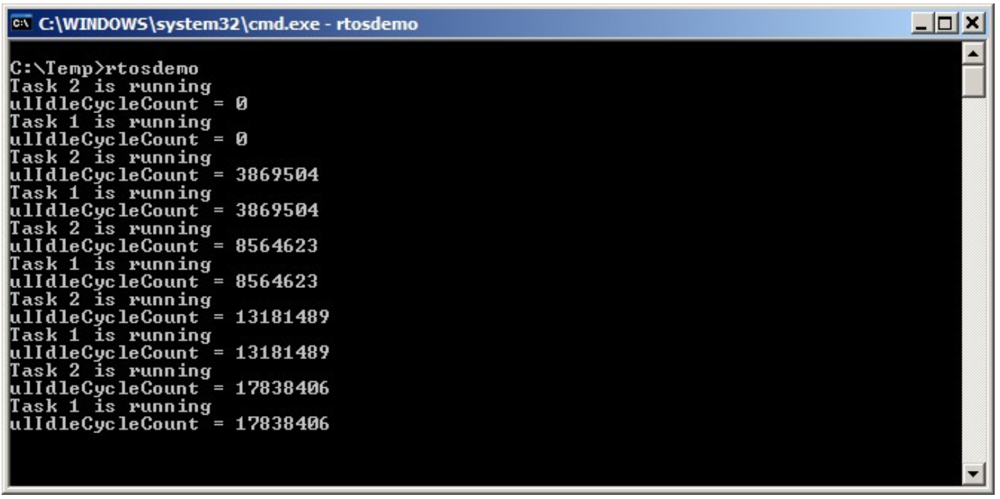

## 更改任务的优先级

### vTaskPrioritySet\(\) API 函数

`vTaskPrioritySet()` API 函数可用于在调度程序启动后更改任何任务的优先级。请注意，当 `FreeRTOSConfig.h` 中的 `INCLUDE_vTaskPrioritySet` 设置为 1 时，`vTaskPrioritySet()` API 函数是可用的。

```c
void vTaskPrioritySet( TaskHandle_t pxTask, UBaseType_t uxNewPriority );
```

清单 31. `vTaskPrioritySet()` API 函数原型

表 11. `vTaskPrioritySet()` 参数

| 参数名称 | 描述 |
| :--- | :--- |
| `pxTask` | 正在修改其优先级的任务的句柄（主题任务）—— 有关获取任务句柄的信息，请参阅`xTaskCreate()` API函数的 `pxCreatedTask` 参数。任务可以通过传递 `NULL` 代替有效的任务句柄来更改自己的优先级。 |
| `uxNewPriority` | 要设置主题任务的优先级。 这自动限制为（`configMAX_PRIORITIES - 1`）的最大可用优先级，其中 `configMAX_PRIORITIES` 是在 `FreeRTOSConfig.h` 头文件中设置编译时间常量。 |

### uxTaskPriorityGet\(\) API 函数

`uxTaskPriorityGet()` API 函数可用于查询任务的优先级。请注意，只有在 `FreeRTOSConfig.h` 中将`INCLUDE_uxTaskPriorityGet` 设置为 1 时，`uxTaskPriorityGet()` API 函数才可用。

```c
UBaseType_t uxTaskPriorityGet( TaskHandle_t pxTask );
```

清单 32. `uxTaskPriorityGet()` API 函数原型

表 12. `uxTaskPriorityGet()`参数和返回值

<table>
  <thead>
    <tr>
      <th style="text-align:left">&#x53C2;&#x6570;&#x540D;&#x79F0;/&#x8FD4;&#x56DE;&#x503C;</th>
      <th style="text-align:left">&#x63CF;&#x8FF0;</th>
    </tr>
  </thead>
  <tbody>
    <tr>
      <td style="text-align:left"><code>pxTask</code>
      </td>
      <td style="text-align:left">
        <p>&#x6B63;&#x5728;&#x67E5;&#x8BE2;&#x5176;&#x4F18;&#x5148;&#x7EA7;&#x7684;&#x4EFB;&#x52A1;&#x7684;&#x53E5;&#x67C4;&#xFF08;&#x4E3B;&#x9898;&#x4EFB;&#x52A1;&#xFF09;&#x2014;
          &#x8BF7;&#x53C2;&#x9605; <code>xTaskCreate()</code>API &#x51FD;&#x6570;&#x7684;<code>pxCreatedTask</code>&#x53C2;&#x6570;&#xFF0C;&#x4EE5;&#x83B7;&#x53D6;&#x6709;&#x5173;&#x83B7;&#x53D6;&#x4EFB;&#x52A1;&#x53E5;&#x67C4;&#x7684;&#x4FE1;&#x606F;&#x3002;</p>
        <p></p>
        <p></p>
        <p>&#x4EFB;&#x52A1;&#x53EF;&#x4EE5;&#x901A;&#x8FC7;&#x4F20;&#x9012;<code> NULL </code>&#x4EE3;&#x66FF;&#x6709;&#x6548;&#x7684;&#x4EFB;&#x52A1;&#x53E5;&#x67C4;&#x6765;&#x67E5;&#x8BE2;&#x81EA;&#x5DF1;&#x7684;&#x4F18;&#x5148;&#x7EA7;&#x3002;</p>
      </td>
    </tr>
    <tr>
      <td style="text-align:left">&#x8FD4;&#x56DE;&#x503C;</td>
      <td style="text-align:left">&#x5F53;&#x524D;&#x5206;&#x914D;&#x7ED9;&#x6B63;&#x5728;&#x67E5;&#x8BE2;&#x7684;&#x4EFB;&#x52A1;&#x7684;&#x4F18;&#x5148;&#x7EA7;&#x3002;</td>
    </tr>
  </tbody>
</table>

      

* &lt;/p&gt;


  &lt;/td&gt;

  &lt;/tr&gt;

  返回值


  &lt;/tr&gt;

  &lt;/tbody&gt;

  &lt;/table&gt;示例 8. 改变任务优先级

调度程序将始终选择最高就绪状态任务作为进入运行状态的任务。示例 8 通过使用 `vTaskPrioritySet()` API 函数来更改两个任务相对于彼此的优先级来证明这一点。

示例 8 以两个不同的优先级创建两个任务。 这两个任务都没有任何 API 函数调用可能导致它进入阻塞状态，因此无法处于就绪状态或运行状态。 因此，具有最高相对优先级的任务将始终是调度程序选择处于 “正在运行” 状态的任务。

示例 8 行为如下：

1. 创建任务 1（清单 33）具有最高优先级，因此保证首先运行。 任务 1 在将任务 2（清单 34）的优先级提高到高于其自己的优先级之前打印出几个字符串。
2. 任务 2 一旦具有最高相对优先级就开始运行（进入运行状态）。 任何时候只有一个任务可以处于运行状态，因此当任务 2 处于运行状态时，任务 1 处于就绪状态。
3. 任务 2 在将自己的优先级设置回低于任务 1 的优先级之前打印出一条消息。
4. 任务 2 将其优先级降低意味着任务 1 再次成为优先级最高的任务，因此任务 1 进入运行状态，强制将任务 2 回到就绪状态。

```c
void vTask1( void *pvParameters )
{
UBaseType_t uxPriority;

    /* 这个任务总是在任务2之前运行，因为它是用更高的优先级创建的。
    Task 1和Task 2都不会阻塞，因此两者都将始终处于运行或就绪状态。 

    查询此任务正在运行的优先级——传入NULL意味着 “返回调用任务的权限”。 */
    uxPriority = uxTaskPriorityGet( NULL );

    for( ;; )
    {
        /* 打印出此任务的名称。 */
        vPrintString( "Task 1 is running\r\n" );

        /* 将 Task 2 的优先级设置在 Task 1 的优先级之上，将导致 Task 2 立即开始运行
        (因为此时 Task 2 的优先级将高于创建的两个任务)。注意在调用 vTaskPrioritySet() 
        时使用 task 2 的句柄( xTask2Handle )。清单 35 显示了如何获得句柄。 */
        vPrintString( "About to raise the Task 2 priority\r\n" );
        vTaskPrioritySet( xTask2Handle, ( uxPriority + 1 ) );

        /* 任务 1 只有在优先级高于任务 2 时才会运行。因此，要使此任务达到此点，
        任务 2 必须已经执行，并将其优先级重新设置为低于此任务的优先级。 */
    }
}
```

清单 33. 示例 8 中任务 1 的实现

```c
void vTask2( void *pvParameters )
{
UBaseType_t uxPriority;

    /* 任务 1 总是在此任务之前运行，因为任务 1 具有更高的优先级。
    任务 1 和任务 2 都不会阻塞，因此总是处于运行或就绪状态。

    查询此任务正在运行的优先级——传入 NULL 意味着“返回调用任务的优先级”。*/
    uxPriority = uxTaskPriorityGet( NULL );

    for( ;; )
    {
        /* 要使此任务达到此点，任务 1 必须已经运行并将此任务的优先级设置为高于其自身的优先级。 

        打印出此任务的名称。 */
        vPrintString( "Task 2 is running\r\n" );

        /* 将此任务的优先级设置回其初始值。传递 NULL 作为任务句柄意味着
        “更改调用任务的优先级”。将任务 1 的优先级设置为低于任务 1 的优先级，
        将导致任务 1 立即重新开始运行，从而抢占该任务。 */
        vPrintString( "About to lower the Task 2 priority\r\n" );
        vTaskPrioritySet( NULL, ( uxPriority - 2) );
    }
}
```

清单 34. 示例 8 中任务 2 的实现

每个任务都可以查询和设置自己的优先级，而不需要使用有效的任务句柄，只需使用 `NULL` 即可。只有当任务希望引用任务本身之外的任务时，才需要任务句柄，例如当任务 1 更改任务 2 的优先级时。为了允许任务 1 这样做，在创建任务 2 时获取并保存任务 2 句柄，如清单 35 中的注释所突出显示的内容。

```c
/* 声明一个用于保存任务 2 句柄的变量。 */
TaskHandle_t xTask2Handle = NULL;

int main( void )
{
    /* 创建优先级为 2 的第一个任务。不使用任务参数并将其设置为 NULL。
    任务句柄也没有使用，因此也设置为 NULL。 */
    xTaskCreate( vTask1, "Task 1", 1000, NULL, 2, NULL );
    /* 任务以优先级 2 创建 _______________________^. */

    /* 创建优先级为 1 的第二个任务——它低于任务1的优先级。同样，没有使用任务参数，
    所以将其设置为 NULL —— 但是这次需要任务句柄，因此在最后一个参数中传递了
    xTask2Handle 的地址。 */
    xTaskCreate( vTask2, "Task 2", 1000, NULL, 1, &xTask2Handle );
    /* 任务句柄是最后一个参数 ________________________^^^^^^^^^^^^^ */

    /* 启动调度程序，使任务开始执行。 */
    vTaskStartScheduler();    

    /* 如果一切正常，那么 main() 将永远不会到达这里，因为调度程序现在将运行这些任务。
    如果 main() 确实到达这里，那么很可能没有足够的堆内存来创建空闲任务。第 2 章提供了
    关于堆内存管理的更多信息。 */
    for( ;; );
}
```

清单 35. 示例 8 的 `main()` 的实现

图 22 显示了示例 8 任务执行的顺序，结果输出如图 23 所示。

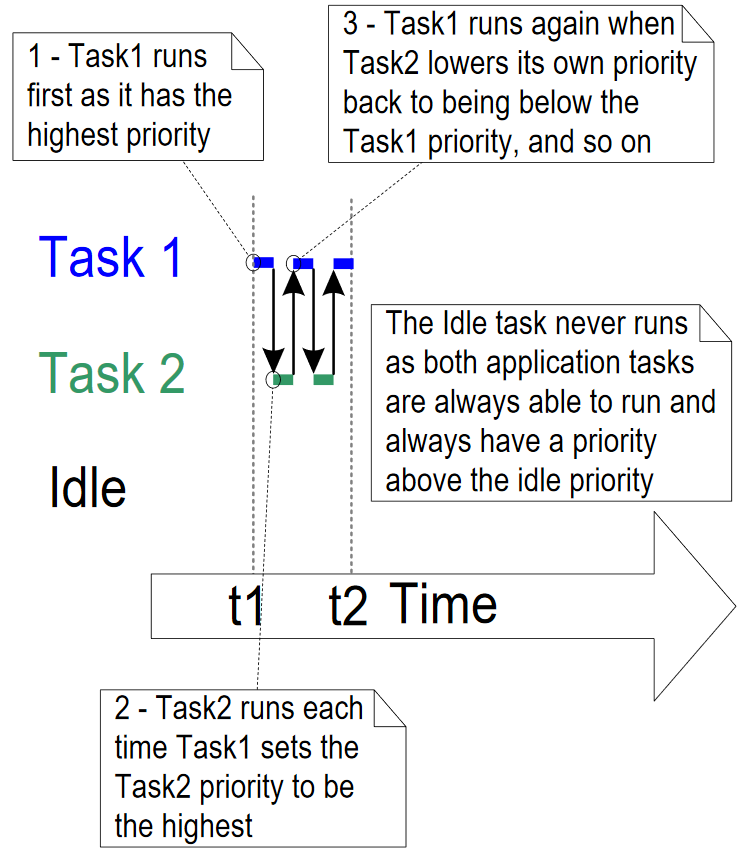

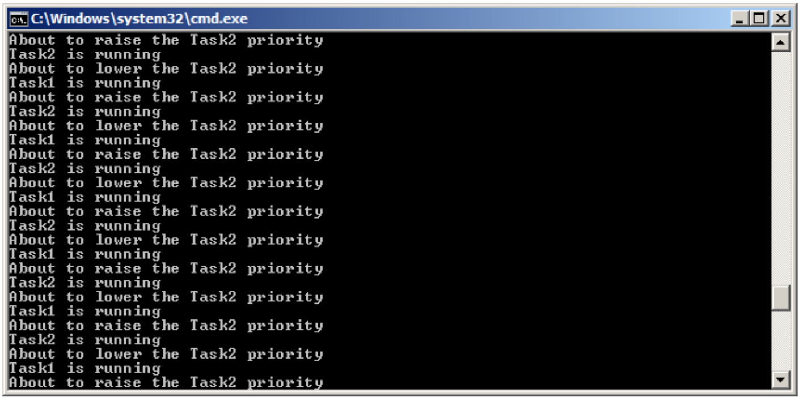

## 删除任务

### vTaskDelete\(\) API 函数

任务可以使用 `vTaskDelete()` API 函数来删除自身或任何其他任务。 请注意，只有在 `FreeRTOSConfig.h` 中将 `INCLUDE_vTaskDelete` 设置为 1 时，`vTaskDelete()`API 函数才可用。

删除的任务将不再存在，且不能再进入运行模式。

释放已删除的任务所分配的内存是空闲任务的职责。因此，重要的是，使用 `vTaskDelete()` API 函数的应用程序不占用所有处理时间，而饿死空闲任务。


只有内核本身分配给任务的内存在删除任务时才会自动释放。任何分配的任务的实现必须明确释放的内存或其他资源。


```c
void vTaskDelete( TaskHandle_t pxTaskToDelete );
```

清单 36. `vTaskDelete()` 函数原型

表 13. `vTaskDelete()` 参数

<table>
  <thead>
    <tr>
      <th style="text-align:left">&#x53C2;&#x6570;&#x540D;&#x79F0;/&#x8FD4;&#x56DE;&#x503C;</th>
      <th style="text-align:left">&#x63CF;&#x8FF0;</th>
    </tr>
  </thead>
  <tbody>
    <tr>
      <td style="text-align:left"><code>pxTaskToDelete</code>
      </td>
      <td style="text-align:left">
        <p>&#x8981;&#x5220;&#x9664;&#x7684;&#x4EFB;&#x52A1;&#x7684;&#x53E5;&#x67C4;&#xFF08;&#x4E3B;&#x9898;&#x4EFB;&#x52A1;&#xFF09;&#x2014;&#x2014;
          &#x8BF7;&#x53C2;&#x9605; <code>xTaskCreate()</code>API &#x51FD;&#x6570;&#x7684;<code>pxCreatedTask</code> &#x53C2;&#x6570;&#xFF0C;&#x4EE5;&#x83B7;&#x53D6;&#x6709;&#x5173;&#x83B7;&#x53D6;&#x4EFB;&#x52A1;&#x53E5;&#x67C4;&#x7684;&#x4FE1;&#x606F;&#x3002;</p>
        <p>&#x4EFB;&#x52A1;&#x53EF;&#x4EE5;&#x901A;&#x8FC7;&#x5728;&#x6709;&#x6548;&#x7684;&#x4EFB;&#x52A1;&#x53E5;&#x67C4;&#x5904;&#x4F20;&#x9012; <code>NULL</code> &#x6765;&#x5220;&#x9664;&#x81EA;&#x5DF1;&#x3002;</p>
      </td>
    </tr>
  </tbody>
</table>

这是一个非常简单的示例，其行为如下。

1. 任务 1 由 `main()` 创建，优先级为 1。当它运行时，它以优先级 2 创建任务 2。任务 2 现在是最高优先级的任务，因此它立即开始执行。`main()` 的源代码如清单 37 所示，任务 1 的源代码如清单 38 所示。
2. 任务 2 除了删除自己之外，什么也不会做。它可以通过向 `vTaskDelete()` 传递 `NULL` 来删除自己，但是处于演示目的，它会使用自己的任务句柄。任务 2  的源代码如清单 39 所示。
3. 当任务 2 被删除后，任务 1 再次成为优先级最高的任务，所以它将继续执行 —— 此时它会调用 `vTaskDelay()` 来阻塞一小段时间。
4. 空闲任务会在任务 1 阻塞状态的时候执行，并释放之前分配给先已删除了的任务 2 的内存。
5. 当任务 1 离开阻塞状态的时候，它将再次变为最高优先级的就绪状态任务，从而抢占空闲任务。当进入运行状态后，它将再次创建任务 2， 并且如此这样继续下去。

```c
int main( void )
{
    /* 以优先级 1 创建第一个任务。不使用任务参数，因此将其设置为NULL。 
    任务句柄也未使用，因此同样设置为NULL。 */
    xTaskCreate( vTask1, "Task 1", 1000, NULL, 1, NULL );
    /* 创建该任务的优先级为 1 ____________________^. */

    /* 启动调度程序，以便任务开始执行。 */
    vTaskStartScheduler();    

    /* 由于调度程序已经启动，main() 永远不会到达此处。 */
    for( ;; );
}
```

清单 37. 示例 9 的 main\(\) 的实现

```c
TaskHandle_t xTask2Handle = NULL;

void vTask1( void *pvParameters )
{
const TickType_txDelay100ms = pdMS_TO_TICKS( 100UL );

    for( ;; )
    {
        /* 打印这个任务的名称 */
        vPrintString( "Task 1 is running\r\n" );

        /* 创建一个更高优先级的任务 2。 同样，没有使用任务参数，所以将其设置为 NULL 
        —— 但是这次需要任务句柄，因此将 xTask2Handle 的地址作为最后一个参数传递。*/
        xTaskCreate( vTask2, "Task 2", 1000, NULL, 2, &xTask2Handle );
        /* 任务句柄是最后一个参数 ________________________^^^^^^^^^^^^^ */

        /* 任务 2 具有更高的优先级，因此任务 1 到达此处任务 2 必须已经执行并自行删除。 
        延迟 100 毫秒。 */
        vTaskDelay( xDelay100ms );
    }
}
```

清单 38. 示例 9 任务 1 的实现

```c
void vTask2( void *pvParameters )
{
    /* Task 2 只做删除本身。要做到这一点，它可以使用 NULL 作为参数调用 vTaskDelete()，
    但是，出于纯粹的演示目的，它在调用 vTaskDelete() 时会传递自己的任务句柄。 */
    vPrintString( "Task 2 is running and about to delete itself\r\n" );
    vTaskDelete( xTask2Handle );
}
```

清单 39. 示例 9 任务 2 的实现

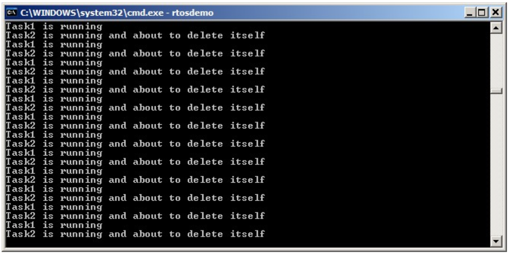

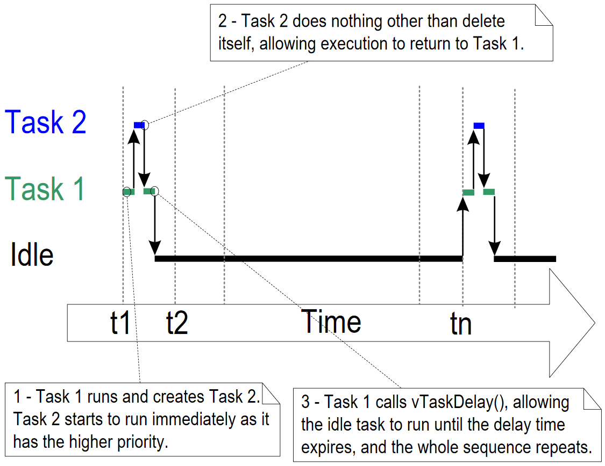

## 线程本地存储

待完成。本节将在最终发布之前编写。


译者注：原文就是待完成。


## 调度算法

### 任务状态和事件的回顾

实际运行的任务（使用处理时间）处于运行状态。 在单核处理器上，在任何给定时间只能有一个任务处于运行状态。

实际上未运行的任务，既没有处于阻塞状态，也没有处于挂起状态，那就是处于就绪状态。调度程序可以选择处于就绪状态的任务作为进入运行状态的任务。调度程序总是选择优先级最高的就绪状态任务来进入运行状态。

任务可以在阻塞状态中等待事件，并在事件发生时自动移动回就绪状态。时间事件发生在特定的时间，例如，当阻塞时间过期时，通常用于实现周期性或超时行为。同步事件发生在任务或中断服务例程使用任务通知、队列、事件组或多种信号量类型之一发送信息时。它们通常用于发出异步活动的信号，例如有数据到达外设。

### 配置调度算法

调度算法是决定哪个就绪状态的任务变成运行任务的程序。

到目前为止，所有示例都使用了相同的调度算法，但可以通过配置 `configUSE_PREEMPTION` 和 `configUSE_TIME_SLICING` 常量更改算法。 两个常量都在 `FreeRTOSConfig.h` 中定义。

第三个配置常量 `configUSE_TICKLESS_IDLE` 也会影响调度算法，因为它的使用会导致滴答中断在较长时间内完全关闭。`configUSE_TICKLESS_IDLE` 是一个高级选项，专门用于必须最小化其功耗的应用程序。 `configUSE_TICKLESS_IDLE` 在第10章，低功耗支持中描述。 本节中提供的描述假设`configUSE_TICKLESS_IDLE` 设置为 0，如果常量未定义，则这是默认设置。

在所有可能的配置中，FreeRTOS 调度程序将确保选择共享优先级的任务以依次进入运行状态。 这种 “反过来” 政策通常被称为 “循环调度”。 循环调度算法不保证在相同优先级的任务之间平均分配时间，只有优先级相同的就绪状态任务依次进入运行状态。

### 具有时间切片的优先抢占式调度

表 14 中所示的配置将 FreeRTOS 调度程序设置为使用称为“带时间切片的固定优先级预先调度” 的调度算法，这是大多数小型 RTOS 应用程序使用的调度算法，以及所有示例中使用的算法。 到目前为止这本书。 表 15 中提供了算法名称中使用的术语的描述。

表 14. `FreeRTOSConfig.h` 用于配置内核以使用带时间片的优先级预先调度的设置

| 常量 | 值 |
| :---: | :---: |
| `configUSE_PREEMPTION` | 1 |
| `configUSE_TIME_SLICING` | 1 |

表 15. 用于描述调度策略的术语的解释

| 术语 | 定义 |
| :---: | :--- |
| 固定优先级 | 描述为 “固定优先级” 的调度算法不会更改分配给正在调度的任务的优先级，但也不会阻止任务本身更改自己的优先级或其他任务的优先级。 |
| 抢占 | 如果优先级高于运行状态任务的任务进入就绪状态，则先发制人调度算法将立即“抢占”运行状态任务。 被抢占意味着不自觉地（不明显地屈服或阻塞）移出运行状态并进入就绪状态以允许不同的任务进入运行状态。 |
| 时间分片 | 时间分片用于在相同优先级的任务之间共享处理时间，即使任务确实明确地产生或进入阻塞状态。 如果存在与运行任务具有相同优先级的其他就绪状态任务，则使用时间分片描述的调度算法将选择新任务以在每个时间片结束时进入运行状态。时间片等于两次 RTOS 滴答中断之间的时间。 |

图 26 和图 27 说明了当使用具有时间分片算法的固定优先级抢占式调度时如何调度任务。 图 26 显示了当应用程序中的所有任务具有唯一优先级时，选择任务以进入“运行”状态的顺序。 图 27 显示了当应用程序中的两个任务共享优先级时，选择任务以进入“运行”状态的顺序。


图 26 参考：

1. **空闲任务**：空闲任务以最低优先级运行，因此每次较高优先级任务进入就绪状态时都会被抢占 —— 例如，在时间 t3，t5 和 t9。
2. **任务 3**：任务 3 是一个事件驱动的任务，它以相对较低的优先级执行，但高于空闲优先级。 它大部分时间都处于阻塞状态，等待其感兴趣的事件，每次事件发生时从阻塞状态转换到就绪状态。 所有 FreeRTOS 任务间通信机制（任务通知，队列，信号量，事件组等）都可用于以这种方式发送事件和解除阻塞任务。事件发生在时间 t3 和 t5，也发生在 t9 和 t12 之间。 在时间 t3 和 t5 发生的事件被立即处理，因为在这些时间，任务 3 是能够运行的最高优先级任务。 在时间 t9 和 t12 之间某处发生的事件直到 t12 才被处理，因为在此之前，优先级较高的任务任务 1 和任务 2 仍在执行。 仅在时间 t12，任务 1和任务 2 都处于阻塞状态，使得任务 3 成为最高优先级就绪状态任务。
3. **任务 2**：任务 2 是周期性任务，其执行优先于任务 3 的优先级，但低于任务 1 的优先级。任务的周期间隔意味着任务 2 想要在时间 t1，t6 和 t9 执行。在时间 t6，任务 3 处于运行状态，但任务 2 具有较高的相对优先级，因此预先占用任务 3 并立即开始执行。 任务 2 完成其处理并在时间 t7 重新进入阻塞状态，此时任务 3 可以重新进入运行状态以完成其处理。 任务 3 本身在时间 t8 阻塞。
4. **任务 1**： 任务 1 也是一个事件驱动任务。 它以所有的最高优先级执行，因此可以抢占系统中的任何其他任务。 所示的唯一任务 1 事件发生在时间 t10，此时任务 1 抢占任务 2。任务 2 仅在任务 1 在时间t11 重新进入阻止状态之后才能完成其处理。


图 27 参考：

1. **空闲任务与任务 2**：空闲任务和任务 2 都是连续处理任务，两者的优先级均为 0（可能的最低优先级）。 当没有能够运行的优先级较高的任务时，调度器会将处理时间分配给优先级为 0 的任务，并通过时间分片共享分配给优先级 0 任务的时间。 每个嘀嗒中断开始一个新的时间片，在图 27 中，时间为 t1，t2，t3，t4，t5，t8，t9，t10 和 t11。空闲任务和任务 2 依次进入运行状态，这可导致两个任务在同一时间片的一部分处于运行状态，如在时间 t5 和时间 t8 之间发生。
2. **任务 1**：任务 1 的优先级高于空闲优先级。 任务 1 是一个事件驱动的任务，它将大部分时间都置于阻塞状态，等待它感兴趣的对象，每次事件发生时从阻塞状态转换到就绪状态。感兴趣的事件发生在时间 t6，因此在 t6，任务 1 成为能够运行的最高优先级任务，因此任务 1 在时间片中部分地抢占空闲任务。 事件的处理在时间 t7 完成，此时任务 1 重新进入阻止状态。

图 27 显示了由应用程序编写者创建的任务的空闲任务共享处理时间。 如果应用程序编写者创建的空闲优先级任务有工作要做，但空闲任务没有，则可能不需要将大量处理时间分配给空闲任务。`configIDLE_SHOULD_YIELD` 编译时配置常量可用于更改空闲任务的调度方式：

* 如果 `configIDLE_SHOULD_YIELD` 设置为 0，那么空闲任务将保持其整个时间片的运行状态，除非它被更高优先级的任务抢占。
* 如果 `configIDLE_SHOULD_YIELD` 设置为 1，那么空闲任务将在其循环的每次迭代中产生（自愿放弃其分配的时间片的剩余部分），并且在就绪状态下还有其他空闲优先级任务。

图 27 中显示的执行模式是当 `configIDLE_SHOULD_YIELD` 设置为 0 时将观察到的内容。图 28 中显示的执行模式是在 `configIDLE_SHOULD_YIELD` 设置为 1 时在同一场景中观察到的内容。

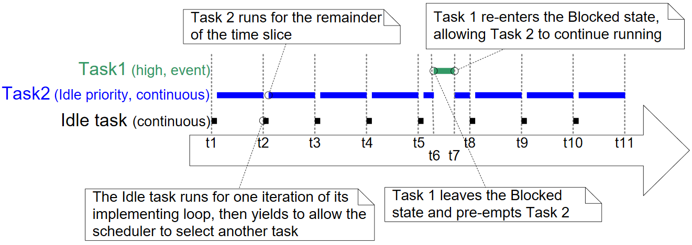

图 28 还显示，当 `configIDLE_SHOULD_YIELD` 设置为 1 时，在空闲任务之后选择进入运行状态的任务不会对整个时间片执行，而是执行转发空闲任务所产生的时间片的剩余时间。

### 优先级抢占式调度\(没有时间分片\)

没有时间分片的优先级抢先式调度保持与前一节中描述的相同的任务选择和抢占算法，但不使用时间分片来共享相同优先级的任务之间的处理时间。

`FreeRTOSConfig.h` 设置将 FreeRTOS 调度程序配置为使用优先级抢占式调度而不进行时间切片，如表 16所示。

表 16. `FreeRTOSConfig.h` 设置，用于配置内核以使用优先级预先调度而无需时间切片

| 常量 | 值 |
| :---: | :---: |
| `configUSE_PREEMPTION` | 1 |
| `configUSE_TIME_SLICING` | 0 |

如图 27 所示，如果使用时间分片，并且有多个能够运行的最高优先级的就绪状态任务，那么调度程序将选择一个新任务以在每个 RTOS 节拍中断期间进入运行状态 （标记时间片结束的滴答中断）。 如果未使用时间分片，则调度程序将仅选择新任务以在以下任一情况下进入运行状态：

* 优先级较高的任务进入就绪状态。
* 处于运行状态的任务进入阻塞或挂起状态。

当不使用时间分片时，与使用时间分片时相比，任务上下文切换更少。 因此，关闭切换时间会导致调度程序的处理开销减少。但是，关闭时间切换也会导致相同优先级的任务接收到大大不同的处理时间量，如图 29 所示。出于这个原因，运行调度程序没有时间切片被认为是一种只有经验丰富的用户才能使用的高级技术。


图 29 参考，假设 `configIDLE_SHOULD_YIELD` 设置为 0：

1. **滴答中断**：滴答中断发生在 t1、t2、t3、t4、t5、t8、t11、t12 和 t13 时刻。
2. **任务 1**：任务 1 是一个高优先级事件驱动的任务，大部分时间都处于阻塞状态，等待它感兴趣的对象发生。 每次事件发生时，任务 1 从阻塞状态转换到就绪状态（并且随后，因为它是最高优先级的就绪状态任务，进入运行状态）。图 29 显示在时间 t6 和 t7 之间处理事件的任务 1， 然后在时间 t9 和 t10 之间再次出现。
3. **空闲任务与任务 2**：空闲任务和任务 2 都是连续处理任务，并且两者都具有优先级 0（空闲优先级）。连续处理任务不进入阻塞状态。未使用时间分片，因此处于“正在运行”状态的空闲优先级任务将保持“正在运行” 状态，直到它被优先级较高的任务 1 抢占为止。在图 29 中，空闲任务在时间 t1 开始运行，并且保持在运行状态，直到它被任务 1 在时间 t6 抢占 —— 这在进入运行状态之后超过四个完整的滴答时段。任务 2 在时间 t7 开始运行，这时任务 1 重新进入阻塞状态以等待另一个事件。 任务 2 保持在运行状态，直到任务 1 在时间 t9 之前被抢占 —— 在进入运行状态之后小于一个滴答周期。在时间 t10，空闲任务重新进入运行状态，尽管已经接收到比任务 2 多四倍以上的处理时间。

### 协作式调度

本书主要介绍抢占式调度，但 FreeRTOS 也可以使用协作式调度。配置 FreeRTOS 调度程序使用协作式调度的 `FreeRTOSConfig.h` 设置如表 17 所示。

表 17. `FreeRTOSConfig.h` 设置，配置内核使用协作式调度

| 常量 | 值 |
| :---: | :---: |
| `configUSE_PREEMPTION` | 0 |
| `configUSE_TIME_SLICING` | 任何值 |

当使用协作式调度程序时，只有在运行状态任务进入阻塞状态，或者运行状态任务通过调用 `taskYIELD()` 显式地产生（手动请求重新调度）时，才会发生上下文的切换。 任务永远不会被抢占，因此不能使用时间切片。

图 30 展示了协作式调度程序的行为。图 30 中的水平虚线显示任务何时处于就绪状态。

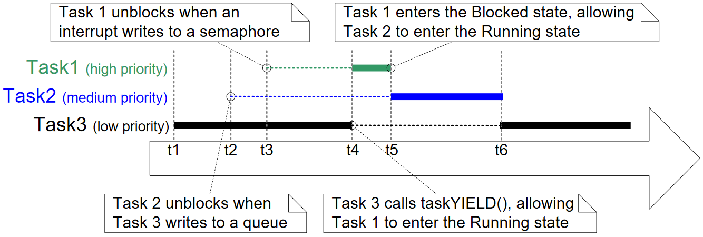

图 30 参考：

1. **任务 1**：任务 1 有最高优先级，它开始于阻塞状态，等待一个信号量。在 t3 时刻，一个中断给予了信号量，引起任务 1 离开阻塞状态并进入就绪状态（第 6 章涵盖了来自中断给与的信号量的相关内容）。在 t3 时刻，任务 1 是最高优先级的任务，如果是抢占模式调度器会将任务 1 直接变成运行态任务，然而在协作式调度下，任务 1 任然是就绪态，直到 t4 ——当运行态的任务调用 `taskYIELD()` 时。
2. **任务 2**：任务 2 的优先级介于任务 1 与任务 3。它同样开始于阻塞状态，等待一个在 t2 时刻由任务 3 发出的消息。在 t2 时刻，任务 2 是最高优先级的就绪态任务，如果是抢占式调度，会将任务 2 直接变成运行态任务，然而在协作式调度下，任务 2 任然是就绪态，知道运行态任务调用 `taskYIELD()` 。运行态任务调用 `taskYIELD()` 在 t4 时刻，但是任务 1 是最高优先级的就绪态任务，所以任务 2 实际没有成为运行态任务，直到 t5 时刻任务 1 重新进入阻塞状态。在 t6 时刻，任务 2 重新进入阻塞状态来等待下一个消息，在这个点任务 3 再一次成为最高优先级的就绪态任务。

在一个多任务应用程序中，应用程序编写者必须注意同一个资源会被多个任务同时访问，因为同时访问可能会对该资源造成破坏。例如，考虑下面的场景，其中访问的时 UART 接口。两个任务是将字符串写入 UART， 任务 1 写的是 `"abcdefghijklmnop"` ，任务 2 写的是 `"123456789"` ：

1. 任务 1 是运行态，并且开始写字符串。当写到 `"abcdefg"` 时离开运行态。
2. 任务 2 进入运行态，同样开始写字符串 `"123456789"` 到 UART，并离开运行态。
3. 任务 1 重新进入，并将剩余的字符串写入 UART。

在这种情况下实际写入 UART 的是 `"abcdefg123456789hijklmnop"` 。任务 1 编写的字符串没有按照预期的顺序完整的写入 UART，而是被破坏了，因为任务 2 写入 UART 的字符串有人出现在其中。

通常，使用协作式调度比抢占式调度更容易避免由于时访问而造成的问题：

* 当使用抢占式调度时，可以在任何时刻抢占运行态的任务，包括与另一个任务共享资源的处于不一致的状态时。正如 UART 的示例所示，让资源处于不一致的状态可能会导致资源损坏。
* 当使用协作式调度时，应用程序编写者控制着任务合适切换到另一个任务。因此，应用程序编写者能够确保资源处于不一致状态时不会被切换到另一个任务。
* 在上面的 UART 示例中，应用程序编写者可以确保任务 1 在整个字符串写入 UART 之前不会离开运行状态，这样做可以消除字符串被另一个任务激活所破坏的可能性。

如图 30 所示，使用协作式调度的系统响应速度将低于抢占式调度的响应速度：

* 当使用抢占式调度时，调度程序将立即开始运行任务，该任务将成为最高优先级的就绪态任务。这在实时系统中，通常是必不可少的，因为实时系统必须在规定的时间内响应最高优先级事件。
* 当使用协作式调度时，只有正在运行的任务进入阻塞状态或者调用 `taskYIELD()` 时，才会切换到已成为最高优先级的就绪态任务。

