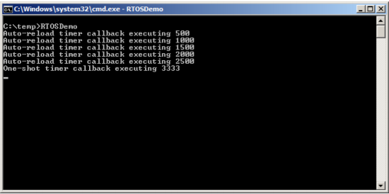
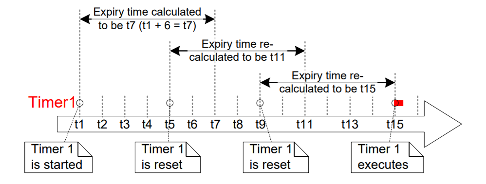
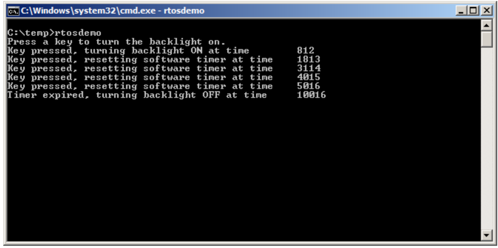

# 软件定时器管理

## 章节介绍和范围

软件计时器用于调度功能在将来的设定时间执行，或以固定频率定期执行。由软件定时器执行的函数称为软件定时器的回调函数。

软件计时器由FreeRTOS内核实现，并受FreeRTOS内核的控制。它们不需要硬件支持，也与硬件计时器或硬件计数器无关。

请注意，根据FreeRTOS使用创新设计以确保最高效率的理念，软件计时器不会使用任何处理时间，除非软件计时器回调函数实际正在执行。

软件计时器功能是可选的。要包括软件计时器功能，请执行以下操作:

1. 将FreeRTOS源文件FreeRTOS/Source/timers.c构建为项目的一部分 
2. 在FreeRTOSConfig.h中将configUSE\_TIMERS设置为1。

### **范围** 

本章旨在让读者更好地了解以下内容：

* 软件定时器的特性与任务特性的比较。
* RTOS后台任务。
* 计时器命令队列。
* 单次软件定时器和周期性软件定时器之间的区别。
* 如何创建、启动、重置和更改软件计时器的周期。

## 软件定时器回调函数

软件计时器回调函数被实现为C函数。它们唯一的特别之处是它们的原型，它必须返回void，并将软件计时器的句柄作为其唯一的参数。清单72演示了回调函数原型。

```c
void ATimerCallback( TimerHandle_t xTimer );
```

清单72.软件计时器回调函数原型

软件计时器回调函数自始至终执行，并以正常方式退出。它们应该保持简短，并且不能进入阻塞状态。


注意：正如将看到的，软件计时器回调函数在启动FreeRTOS调度程序时自动创建的任务的上下文中执行。 因此，软件计时器回调函数决不能调用会导致调用任务进入阻塞状态的FreeRTOS API函数，这一点至关重要。 可以调用xQueueReceive\(\)之类的函数，但前提是该函数的xTicksToWait参数\(指定函数的阻塞时间\)设置为0。 调用vTaskDelay\(\)之类的函数是不对的，因为调用vTaskDelay\(\)会始终将调用任务置于阻塞状态。


## 软件计时器的属性和状态

### **软件计时器的周期** 

软件计时器的‘周期’是软件计时器启动和软件计时器的回调函数执行之间的时间

### **单次计时器和自动重新加载计时器**

有两种类型的软件计时器：

1. 单次计时器 一旦启动，一次性定时器将只执行其回调函数一次。一次性计时器可以手动重新启动，但不会自行重新启动。
2. 自动重新加载计时器 一旦启动，自动重新加载计时器将在每次到期时重新启动，从而定期执行其回调函数。

图38显示了单次定时器和自动重新加载定时器之间的行为差异。虚线垂直线标记计时中断发生的时间。


参考图38：

* 计时器1 定时器1是具有6个滴答周期的一次性定时器。它在时间t1启动，因此它的回调函数在6个刻度之后，即时间t7执行。由于定时器1是一次性定时器，其回调函数不会再次执行。
* 计时器2 定时器2是具有5个滴答周期的自动重新加载定时器。它在时间t1启动，因此它的回调函数在时间t1之后每5个节拍执行一次。在图38中，这是时间t6、t11和t16。

### **软件计时器状态** 

软件计时器可以处于以下两种状态之一：

* 休眠：存在休眠的软件计时器，可以由其句柄引用，但不在运行，因此其回调函数将不会执行
* 运行：正在运行的软件定时器，将在自该软件定时器进入运行状态，或自该软件定时器上次被重置以来经过与其周期相等的时间之后执行其回调功能。

图39和图40分别显示了自动重新加载定时器和单次定时器在休眠和运行状态之间可能的转换。这两个图的关键区别在于定时器到期后进入的状态；自动重新加载定时器执行其回调函数，然后重新进入运行状态，一次性定时器执行其回调函数，然后进入休眠状态。

xTimerDelete\(\)接口函数的作用是：删除计时器。可以随时删除计时器。


## 软件定时器的上下文

### **RTOS守护\(计时器服务\)任务**

所有软件计时器回调函数都在同一RTOS守护进程\(或“计时器服务”\)任务的上下文中执行\[1\]。

* _\[1\]. 该任务过去被称为“计时器服务任务”，因为最初它只用于执行软件计时器回调函数。现在同一任务也用于其他目的，因此它被称为“RTOS守护程序任务”的更一般的名称。_

守护程序任务，是在启动调度程序时，自动创建的标准FreeRTOS任务。其优先级和堆栈大小分别由`configTIMER_TASK_PRIORITY`和`configTIMER_TASK_STACK_DEPTH`编译时间配置常量设置。这两个常量都在FreeRTOSConfig.h中定义。

软件计时器回调函数不得调用会导致调用任务进入阻塞状态的FreeRTOS API函数，否则将导致守护程序任务进入阻塞状态。

### **计时器命令队列**

软件计时器API函数将命令从调用任务发送到称为“计时器命令队列”的队列上的守护程序任务。这如图41所示。命令的例子包括“启动定时器”、“停止定时器”和“重置定时器”。

计时器命令队列是在启动调度程序时自动创建的标准FreeRTOS队列。定时器命令队列的长度由FreeRTOSConfig.h中的`configTIMER_QUEUE_LENGTH`编译时间配置常量设置。


### **守护进程任务调度**

守护程序任务与任何其他FreeRTOS任务一样进行调度；当守护程序任务是能够运行的最高优先级任务时，它只会处理命令或执行计时器回调函数。图42和图43演示了`configTIMER_TASK_PRIORITY`设置如何影响执行模式

图42显示了当守护程序任务的优先级低于调用`xTimerStart()`API函数的任务的优先级时的执行模式


参照图42，其中任务1的优先级高于守护程序任务的优先级，并且守护程序任务的优先级高于空闲任务的优先级：

1. t1时刻 ：任务1处于RUNNING状态，守护程序任务处于BLOCKED状态。 守护程序任务将脱离阻塞状态，如果一个命令被发送到计时器命令队列，在这种情况下，它将处理命令。或者如果软件计时器超时，在这种情况下，它将执行软件计时器的回调函数。
2. t2时刻：任务1调用`xTimerStart()`。 `xTimerStart()`向计时器命令队列发送命令，使守护程序任务离开阻塞状态。 任务1的优先级高于守护程序任务的优先级，因此守护程序任务不会抢占任务1。 任务1仍处于Running状态，守护程序任务已离开BLOCKED状态，进入READY状态。
3. t3时刻：任务1完成`xTimerStart()`API函数的执行。 任务1从函数开始到函数结束执行`xTimerStart()`，而不离开运行状态。
4. t4时刻：任务1调用导致其进入阻塞状态的API函数。守护程序任务现在是处于就绪状态的最高优先级任务，因此调度程序选择守护程序任务作为进入运行状态的任务。然后，守护程序任务开始处理任务1发送到计时器命令队列的命令。 _注意：正在启动的软件计时器将到期的时间，是从向计时器命令队列发送“启动计时器”命令开始计算的，而不是从守护程序任务从计时器命令队列接收到“启动计时器”命令的时间计算的。_
5. t5时刻：守护程序任务已完成对任务1发送给它的命令的处理，并尝试从计时器命令队列接收更多数据。计时器命令队列为空，因此守护程序任务重新进入阻塞状态。如果将命令发送到计时器命令队列，或者如果软件计时器超时，则守护程序任务将再次离开阻塞状态。空闲任务现在是处于就绪状态的最高优先级任务，因此调度程序选择空闲任务作为要进入运行状态的任务。

图43显示了类似于图42所示的场景，但是这一次守护程序任务的优先级高于调用`xTimerStart()`的任务的优先级。


参照图43，其中守护任务的优先级高于任务1的优先级，任务1的优先级高于空闲任务的优先级： 1. t1时刻 和之前一样，任务1正在运行态，守护任务在阻塞态。

1. t2时刻 任务1调用`xTimerStart()`。 `xTimerStart()`向计时器命令队列发送命令，使守护程序任务离开阻塞状态。守护程序任务的优先级高于任务1的优先级，因此调度器选择守护程序任务作为进入运行状态的任务。 任务1在完成执行`xTimerStart()`函数之前被守护程序任务抢占，现在处于就绪状态。守护程序任务开始处理任务1发送到定时器命令队列的命令。
2. t3时刻 守护程序任务已完成对任务1发送给它的命令的处理，并尝试从计时器命令队列接收更多数据。 计时器命令队列为空，因此守护程序任务重新进入阻塞状态。 任务1现在是处于就绪状态的最高优先级任务，因此调度程序选择任务1作为要进入运行状态的任务。
3. t4时刻 任务1在完成执行`xTimerStart()`函数之前被守护程序任务抢占，并且只有在重新进入运行状态后才退出\(从\)`xTimerStart()`。
4. t5时刻 任务1调用导致其进入阻塞状态的API函数。空闲任务现在是处于就绪状态的最高优先级任务，因此调度程序选择空闲任务作为要进入运行状态的任务。

在图42所示的场景中，任务1向计时器命令队列发送命令与守护进程任务接收和处理命令之间经过了一段时间。在图43所示的场景中，在Task1从发送命令的函数返回之前，守护进程任务已经接收并处理了Task1发送给它的命令。

发送到计时器命令队列的命令包含时间戳。时间戳用于说明从应用程序任务发送的命令到守护程序任务正在处理的同一命令之间经过的任何时间。例如，如果发送“启动计时器”命令来启动周期为10个滴答的计时器，则时间戳用于确保计时器是在命令发送后10个滴答超时，而不是在命令被守护进程处理之后10个滴答超时。

## 创建和开始一个软件定时器

### **xTimerCreate\(\)API函数**

 FreeRTOS V9.0.0还包括`xTimerCreateStatic()`函数，该函数分配在编译时静态创建计时器所需的内存：软件计时器必须先显式创建，然后才能使用。

软件计时器由`TimerHandle_t`类型的变量引用。`xTimerCreate()`用于创建软件计时器，并返回`TimerHandle_t`以引用其创建的软件计时器。软件计时器在休眠状态下创建。

可以在调度器运行之前创建软件计时器，也可以在调度器启动后从任务创建软件计时器。第0节介绍了使用的数据类型和命名约定。

```c
TimerHandle_t xTimerCreate( const char * const pcTimerName, 
                                TickType_t xTimerPeriodInTicks, 
                                UBaseType_t uxAutoReload, 
                                void * pvTimerID, 
                                TimerCallbackFunction_t pxCallbackFunction );
```

**清单73. xTimerCreate\(\)API函数原型**

**表27. xTimerCreate\(\)参数和返回值**

<table>
  <thead>
    <tr>
      <th style="text-align:left">&#x53C2;&#x6570;/&#x8FD4;&#x56DE;&#x503C;</th>
      <th style="text-align:left">&#x63CF;&#x8FF0;</th>
    </tr>
  </thead>
  <tbody>
    <tr>
      <td style="text-align:left">pcTimerName</td>
      <td style="text-align:left">&#x8BA1;&#x65F6;&#x5668;&#x7684;&#x63CF;&#x8FF0;&#x6027;&#x540D;&#x79F0;&#x3002;FreeRTOS&#x4E0D;&#x4F1A;&#x4EE5;&#x4EFB;&#x4F55;&#x65B9;&#x5F0F;&#x4F7F;&#x7528;&#x5B83;&#x3002;&#x5B83;&#x7EAF;&#x7CB9;&#x662F;&#x4F5C;&#x4E3A;&#x8C03;&#x8BD5;&#x8F85;&#x52A9;&#x5DE5;&#x5177;&#x800C;&#x5305;&#x542B;&#x7684;&#x3002;&#x4F7F;&#x7528;&#x4EBA;&#x7C7B;&#x53EF;&#x8BFB;&#x7684;&#x540D;&#x79F0;&#x6807;&#x8BC6;&#x8BA1;&#x65F6;&#x5668;&#x6BD4;&#x5C1D;&#x8BD5;&#x901A;&#x8FC7;&#x5176;&#x53E5;&#x67C4;&#x6807;&#x8BC6;&#x8981;&#x7B80;&#x5355;&#x5F97;&#x591A;&#x3002;</td>
    </tr>
    <tr>
      <td style="text-align:left">xTimerPeriodInTicks</td>
      <td style="text-align:left">&#x4EE5;&#x523B;&#x5EA6;&#x4E3A;&#x5355;&#x4F4D;&#x6307;&#x5B9A;&#x7684;&#x8BA1;&#x65F6;&#x5668;&#x5468;&#x671F;&#x3002;<code>pdMS_TO_TICKS()</code>&#x5B8F;&#x53EF;&#x7528;&#x4E8E;&#x5C06;&#x4EE5;&#x6BEB;&#x79D2;&#x4E3A;&#x5355;&#x4F4D;&#x6307;&#x5B9A;&#x7684;&#x65F6;&#x95F4;&#x8F6C;&#x6362;&#x4E3A;&#x4EE5;&#x8BA1;&#x65F6;&#x5355;&#x4F4D;&#x6307;&#x5B9A;&#x7684;&#x65F6;&#x95F4;&#x3002;</td>
    </tr>
    <tr>
      <td style="text-align:left">uxAutoReload</td>
      <td style="text-align:left">&#x5C06;<code>uxAutoReload</code>&#x8BBE;&#x7F6E;&#x4E3A;pdTRUE&#x4EE5;&#x521B;&#x5EFA;&#x81EA;&#x52A8;&#x91CD;&#x65B0;&#x52A0;&#x8F7D;&#x8BA1;&#x65F6;&#x5668;&#x3002;&#x5C06;<code>uxAutoReload</code>&#x8BBE;&#x7F6E;&#x4E3A;pdFALSE&#x4EE5;&#x521B;&#x5EFA;&#x4E00;&#x6B21;&#x6027;&#x8BA1;&#x65F6;&#x5668;</td>
    </tr>
    <tr>
      <td style="text-align:left">pvTimerID</td>
      <td style="text-align:left">
        <p>&#x6BCF;&#x4E2A;&#x8F6F;&#x4EF6;&#x5B9A;&#x65F6;&#x5668;&#x90FD;&#x6709;&#x4E00;&#x4E2A;ID&#x503C;&#x3002;ID&#x662F;&#x4E00;&#x4E2A;&#x7A7A;&#x6307;&#x9488;&#xFF0C;&#x5E94;&#x7528;&#x7A0B;&#x5E8F;&#x7F16;&#x5199;&#x5668;&#x53EF;&#x4EE5;&#x5C06;&#x5176;&#x7528;&#x4E8E;&#x4EFB;&#x4F55;&#x76EE;&#x7684;&#x3002;&#x5F53;&#x591A;&#x4E2A;&#x8F6F;&#x4EF6;&#x8BA1;&#x65F6;&#x5668;&#x4F7F;&#x7528;&#x76F8;&#x540C;&#x7684;&#x56DE;&#x8C03;&#x51FD;&#x6570;&#x65F6;&#xFF0C;ID&#x7279;&#x522B;&#x6709;&#x7528;&#xFF0C;&#x56E0;&#x4E3A;&#x5B83;&#x53EF;&#x7528;&#x4E8E;&#x63D0;&#x4F9B;&#x7279;&#x5B9A;&#x4E8E;&#x8BA1;&#x65F6;&#x5668;&#x7684;&#x5B58;&#x50A8;&#x3002;</p>
        <p></p>
        <p>&#x672C;&#x7AE0;&#x4E2D;&#x7684;&#x4E00;&#x4E2A;&#x793A;&#x4F8B;&#x6F14;&#x793A;&#x4E86;&#x8BA1;&#x65F6;&#x5668;ID&#x7684;&#x4F7F;&#x7528;&#x3002;
          pvTimerID&#x8BBE;&#x7F6E;&#x6B63;&#x5728;&#x521B;&#x5EFA;&#x7684;&#x4EFB;&#x52A1;&#x7684;ID&#x7684;&#x521D;&#x59CB;&#x503C;&#x3002;</p>
      </td>
    </tr>
    <tr>
      <td style="text-align:left">pxCallbackFunction</td>
      <td style="text-align:left">&#x8F6F;&#x4EF6;&#x8BA1;&#x65F6;&#x5668;&#x56DE;&#x8C03;&#x51FD;&#x6570;&#x4EC5;&#x4EC5;&#x662F;&#x7B26;&#x5408;&#x6E05;&#x5355;72&#x4E2D;&#x6240;&#x793A;&#x539F;&#x578B;&#x7684;C&#x51FD;&#x6570;&#x3002;<code>pxCallbackFunction</code>&#x53C2;&#x6570;&#x662F;&#x6307;&#x5411;&#x8981;&#x7528;&#x4F5C;&#x6B63;&#x5728;&#x521B;&#x5EFA;&#x7684;&#x8F6F;&#x4EF6;&#x8BA1;&#x65F6;&#x5668;&#x7684;&#x56DE;&#x8C03;&#x51FD;&#x6570;&#x7684;&#x51FD;&#x6570;&#x6307;&#x9488;(&#x5B9E;&#x9645;&#x4E0A;&#x5C31;&#x662F;&#x51FD;&#x6570;&#x540D;)&#x3002;</td>
    </tr>
    <tr>
      <td style="text-align:left">&#x8FD4;&#x56DE;&#x503C;</td>
      <td style="text-align:left">
        <p>&#x5982;&#x679C;&#x8FD4;&#x56DE;NULL&#xFF0C;&#x5219;&#x65E0;&#x6CD5;&#x521B;&#x5EFA;&#x8F6F;&#x4EF6;&#x8BA1;&#x65F6;&#x5668;&#xFF0C;&#x56E0;&#x4E3A;FreeRTOS&#x6CA1;&#x6709;&#x8DB3;&#x591F;&#x7684;&#x5806;&#x5185;&#x5B58;&#x6765;&#x5206;&#x914D;&#x5FC5;&#x8981;&#x7684;&#x6570;&#x636E;&#x7ED3;&#x6784;&#x3002;</p>
        <p></p>
        <p>&#x8FD4;&#x56DE;&#x7684;&#x975E;NULL&#x503C;&#x8868;&#x793A;&#x8F6F;&#x4EF6;&#x8BA1;&#x65F6;&#x5668;&#x5DF2;&#x6210;&#x529F;&#x521B;&#x5EFA;&#x3002;&#x8FD4;&#x56DE;&#x503C;&#x662F;&#x521B;&#x5EFA;&#x7684;&#x8BA1;&#x65F6;&#x5668;&#x7684;&#x53E5;&#x67C4;&#x3002;
          &#x7B2C;2&#x7AE0;&#x63D0;&#x4F9B;&#x4E86;&#x6709;&#x5173;&#x5806;&#x5185;&#x5B58;&#x7BA1;&#x7406;&#x7684;&#x66F4;&#x591A;&#x4FE1;&#x606F;&#x3002;</p>
      </td>
    </tr>
  </tbody>
</table>### **xTimerStart\(\)API函数**

`xTimerStart()`用于启动处于休眠状态的软件定时器，或重置\(重新启动\)处于运行状态的软件定时器。`xTimerStop()`用于停止处于运行状态的软件计时器。停止软件计时器与将计时器转换到休眠状态相同。

可以在调度程序启动之前调用`xTimerStart()`，但是当这样做时，软件计时器直到调度程序启动时才会实际启动。


注意：切勿从中断服务例程调用xTimerStart\(\)。应该使用中断安全版本xTimerStartFromISR\(\)来代替它。


```c
BaseType_t xTimerStart( TimerHandle_t xTimer, TickType_t xTicksToWait );
```

**清单74. xTimerStart\(\)API函数原型**

**表28. xTimerStart\(\)参数和返回值**

<table>
  <thead>
    <tr>
      <th style="text-align:left">&#x53C2;&#x6570;/&#x8FD4;&#x56DE;&#x503C;</th>
      <th style="text-align:left">&#x63CF;&#x8FF0;</th>
    </tr>
  </thead>
  <tbody>
    <tr>
      <td style="text-align:left">xTimer</td>
      <td style="text-align:left">&#x6B63;&#x5728;&#x542F;&#x52A8;&#x6216;&#x91CD;&#x7F6E;&#x7684;&#x8F6F;&#x4EF6;&#x8BA1;&#x65F6;&#x5668;&#x7684;&#x53E5;&#x67C4;&#x3002;&#x53E5;&#x67C4;&#x5C06;&#x4ECE;&#x7528;&#x4E8E;&#x521B;&#x5EFA;&#x8F6F;&#x4EF6;&#x8BA1;&#x65F6;&#x5668;&#x7684;<code>xTimerCreate()</code>&#x8C03;&#x7528;&#x4E2D;&#x8FD4;&#x56DE;&#x3002;</td>
    </tr>
    <tr>
      <td style="text-align:left">xTicksToWait</td>
      <td style="text-align:left">
        <p><code>xTimerStart()</code>&#x4F7F;&#x7528;&#x8BA1;&#x65F6;&#x5668;&#x547D;&#x4EE4;&#x961F;&#x5217;&#x5411;&#x5B88;&#x62A4;&#x7A0B;&#x5E8F;&#x4EFB;&#x52A1;&#x53D1;&#x9001;&#x201C;&#x542F;&#x52A8;&#x8BA1;&#x65F6;&#x5668;&#x201D;&#x547D;&#x4EE4;&#x3002;</p>
        <p></p>
        <p><code>xTicksToWait</code>&#x6307;&#x5B9A;&#x5982;&#x679C;&#x961F;&#x5217;&#x5DF2;&#x6EE1;&#xFF0C;&#x8C03;&#x7528;&#x4EFB;&#x52A1;&#x5E94;&#x4FDD;&#x6301;&#x5728;&#x963B;&#x585E;&#x72B6;&#x6001;&#x4EE5;&#x7B49;&#x5F85;&#x8BA1;&#x65F6;&#x5668;&#x547D;&#x4EE4;&#x961F;&#x5217;&#x4E0A;&#x7684;&#x7A7A;&#x95F4;&#x53D8;&#x4E3A;&#x53EF;&#x7528;&#x7684;&#x6700;&#x957F;&#x65F6;&#x95F4;&#x3002;</p>
        <p><b><br /></b>&#x5982;&#x679C;<code>xTicksToWait</code>&#x4E3A;&#x96F6;&#x4E14;&#x8BA1;&#x65F6;&#x5668;&#x547D;&#x4EE4;&#x961F;&#x5217;&#x5DF2;&#x6EE1;&#xFF0C;&#x5219;<code>xTimerStart()</code>&#x5C06;&#x7ACB;&#x5373;&#x8FD4;&#x56DE;&#x3002;</p>
        <p>
          <br />&#x963B;&#x585E;&#x65F6;&#x95F4;&#x4EE5;&#x6EF4;&#x7B54;&#x5468;&#x671F;&#x6307;&#x5B9A;&#xFF0C;&#x56E0;&#x6B64;&#x5B83;&#x8868;&#x793A;&#x7684;&#x7EDD;&#x5BF9;&#x65F6;&#x95F4;&#x53D6;&#x51B3;&#x4E8E;&#x6EF4;&#x7B54;&#x9891;&#x7387;&#x3002;&#x5B8F;<code>pdMS_TO_TICKS()</code>&#x53EF;&#x7528;&#x4E8E;&#x5C06;&#x4EE5;&#x6BEB;&#x79D2;&#x4E3A;&#x5355;&#x4F4D;&#x7684;&#x65F6;&#x95F4;&#x8F6C;&#x6362;&#x4E3A;&#x4EE5;&#x6EF4;&#x7B54;&#x4E3A;&#x5355;&#x4F4D;&#x7684;&#x65F6;&#x95F4;&#x3002;
          <br
          />
        </p>
        <p>&#x5982;&#x679C;<code>FreeRTOSConfig.h</code>&#x4E2D;&#x7684;i<code>nclude_vTaskSuspend</code>&#x8BBE;&#x7F6E;&#x4E3A;1&#xFF0C;&#x5219;&#x3002;&#x5C06;<code>xTicksToWait</code>&#x8BBE;&#x7F6E;&#x4E3A;<code>portMAX_DELAY</code>&#x5C06;&#x5BFC;&#x81F4;&#x8C03;&#x7528;&#x4EFB;&#x52A1;&#x65E0;&#x9650;&#x671F;&#x5730;&#x4FDD;&#x6301;&#x5728;&#x963B;&#x585E;&#x72B6;&#x6001;(&#x6CA1;&#x6709;&#x8D85;&#x65F6;)&#xFF0C;&#x4EE5;&#x7B49;&#x5F85;&#x5B9A;&#x65F6;&#x5668;&#x547D;&#x4EE4;&#x961F;&#x5217;&#x4E2D;&#x7684;&#x7A7A;&#x95F4;&#x53D8;&#x5F97;&#x53EF;&#x7528;&#x3002;
          <br
          />
        </p>
        <p>&#x5982;&#x679C;&#x5728;&#x8C03;&#x5EA6;&#x7A0B;&#x5E8F;&#x542F;&#x52A8;&#x4E4B;&#x524D;&#x8C03;&#x7528;<code>xTimerStart()</code>&#xFF0C;&#x5219;&#x4F1A;&#x5FFD;&#x7565;<code>xTicksToWait</code>&#x7684;&#x503C;&#xFF0C;&#x5E76;&#x4E14;<code>xTimerStart()</code>&#x7684;&#x884C;&#x4E3A;&#x5C31;&#x50CF;<code>xTicksToWait</code>&#x5DF2;&#x8BBE;&#x7F6E;&#x4E3A;&#x96F6;&#x4E00;&#x6837;&#x3002;</p>
      </td>
    </tr>
    <tr>
      <td style="text-align:left">&#x8FD4;&#x56DE;&#x503C;</td>
      <td style="text-align:left">
        <p>&#x6709;&#x4E24;&#x4E2A;&#x53EF;&#x80FD;&#x7684;&#x8FD4;&#x56DE;&#x503C;</p>
        <p>
          <br />1. pdPASS</p>
        <p>
          <br />&#x53EA;&#x6709;&#x5F53;&#x201C;&#x542F;&#x52A8;&#x5B9A;&#x65F6;&#x5668;&#x201D;&#x547D;&#x4EE4;&#x6210;&#x529F;&#x53D1;&#x9001;&#x5230;&#x5B9A;&#x65F6;&#x5668;&#x547D;&#x4EE4;&#x961F;&#x5217;&#x65F6;&#xFF0C;&#x624D;&#x4F1A;&#x8FD4;&#x56DE;pdPASS&#x3002;
          <br
          />
          <br />&#x5982;&#x679C;&#x5B88;&#x62A4;&#x7A0B;&#x5E8F;&#x4EFB;&#x52A1;&#x7684;&#x4F18;&#x5148;&#x7EA7;&#x9AD8;&#x4E8E;&#x8C03;&#x7528;<code>xTimerStart()</code>&#x7684;&#x4EFB;&#x52A1;&#x7684;&#x4F18;&#x5148;&#x7EA7;&#xFF0C;&#x90A3;&#x4E48;&#x8C03;&#x5EA6;&#x7A0B;&#x5E8F;&#x5C06;&#x786E;&#x4FDD;&#x5728;<code>xTimerStart()</code>&#x8FD4;&#x56DE;&#x4E4B;&#x524D;&#x5904;&#x7406;&#x542F;&#x52A8;&#x547D;&#x4EE4;&#x3002;&#x8FD9;&#x662F;&#x56E0;&#x4E3A;&#x4E00;&#x65E6;&#x8BA1;&#x65F6;&#x5668;&#x547D;&#x4EE4;&#x961F;&#x5217;&#x4E2D;&#x6709;&#x6570;&#x636E;&#xFF0C;&#x5B88;&#x62A4;&#x8FDB;&#x7A0B;&#x4EFB;&#x52A1;&#x5C31;&#x4F1A;&#x62A2;&#x5360;&#x8C03;&#x7528;<code>xTimerStart()</code>&#x7684;&#x4EFB;&#x52A1;&#x3002;
          <br
          />
        </p>
        <p>&#x5982;&#x679C;&#x6307;&#x5B9A;&#x4E86;&#x963B;&#x585E;&#x65F6;&#x95F4;(<code>xTicksToWait</code>&#x4E0D;&#x662F;&#x96F6;)&#xFF0C;&#x5219;&#x5728;&#x51FD;&#x6570;&#x8FD4;&#x56DE;&#x4E4B;&#x524D;&#xFF0C;&#x8C03;&#x7528;&#x4EFB;&#x52A1;&#x53EF;&#x80FD;&#x88AB;&#x7F6E;&#x4E8E;&#x963B;&#x585E;&#x72B6;&#x6001;&#xFF0C;&#x4EE5;&#x7B49;&#x5F85;&#x8BA1;&#x65F6;&#x5668;&#x547D;&#x4EE4;&#x961F;&#x5217;&#x4E2D;&#x7684;&#x7A7A;&#x95F4;&#x53D8;&#x4E3A;&#x53EF;&#x7528;&#xFF0C;&#x4F46;&#x5728;&#x5757;&#x65F6;&#x95F4;&#x5230;&#x671F;&#x4E4B;&#x524D;&#xFF0C;&#x6570;&#x636E;&#x5DF2;&#x6210;&#x529F;&#x5199;&#x5165;&#x8BA1;&#x65F6;&#x5668;&#x547D;&#x4EE4;&#x961F;&#x5217;&#x3002;</p>
        <p></p>
        <p>2.pdFALSE
          <br />
          <br />&#x5982;&#x679C;&#x7531;&#x4E8E;&#x961F;&#x5217;&#x5DF2;&#x6EE1;&#x800C;&#x65E0;&#x6CD5;&#x5C06;&#x201C;&#x542F;&#x52A8;&#x5B9A;&#x65F6;&#x5668;&#x201D;&#x547D;&#x4EE4;&#x5199;&#x5165;&#x5B9A;&#x65F6;&#x5668;&#x547D;&#x4EE4;&#x961F;&#x5217;&#xFF0C;&#x5219;&#x5C06;&#x8FD4;&#x56DE;pdFALSE&#x3002;
          <br
          />
        </p>
        <p>&#x5982;&#x679C;&#x6307;&#x5B9A;&#x4E86;&#x963B;&#x585E;&#x65F6;&#x95F4;(<code>xTicksToWait</code>&#x4E0D;&#x662F;&#x96F6;)&#xFF0C;&#x5219;&#x8C03;&#x7528;&#x4EFB;&#x52A1;&#x5C06;&#x88AB;&#x7F6E;&#x4E8E;&#x963B;&#x585E;&#x72B6;&#x6001;&#xFF0C;&#x4EE5;&#x7B49;&#x5F85;&#x5B88;&#x62A4;&#x8FDB;&#x7A0B;&#x4EFB;&#x52A1;&#x5728;&#x8BA1;&#x65F6;&#x5668;&#x547D;&#x4EE4;&#x961F;&#x5217;&#x4E2D;&#x817E;&#x51FA;&#x7A7A;&#x95F4;&#xFF0C;&#x4F46;&#x6307;&#x5B9A;&#x7684;&#x963B;&#x585E;&#x65F6;&#x95F4;&#x5728;&#x6B64;&#x4E4B;&#x524D;&#x5DF2;&#x8FC7;&#x671F;&#x3002;</p>
      </td>
    </tr>
  </tbody>
</table>此示例创建并启动一个一次性计时器和一个自动重新加载计时器-如清单75所示。

```c
/* 分配给单次和自动重新加载计时器的周期分别为3.333秒和半秒。 */ 
#define mainONE_SHOT_TIMER_PERIOD pdMS_TO_TICKS( 3333 )
#define mainAUTO_RELOAD_TIMER_PERIOD pdMS_TO_TICKS( 500 ) 
int main( void )
 {
 TimerHandle_t xAutoReloadTimer, xOneShotTimer;
 BaseType_t xTimer1Started, xTimer2Started;
    /* 创建一次计时器，将创建的计时器的句柄存储在xOneShotTimer中。*/  
    xOneShotTimer = xTimerCreate( 
    /* 软件计时器的文本名称-未由FreeRTOS使用。*/
    "OneShot",
    /*软件计时器的周期(以滴答为单位)。*/
    mainONE_SHOT_TIMER_PERIOD,
    /* 将uxAutoRealod设置为pdFALSE将创建一次性软件计时器。*/
    pdFALSE,
    /* 此示例不使用计时器ID。*/
    0,
    /* 要由正在创建的软件计时器使用的回调函数。*/
    prvOneShotTimerCallback );

    /* 创建自动重新加载计时器，将创建的计时器的句柄存储在xAutoReloadTimer中。*/ 
    xAutoReloadTimer = xTimerCreate( 
    /* 软件计时器的文本名称-未由FreeRTOS使用。 */
    "AutoReload",
    /* 软件计时器的周期(以滴答为单位)。*/
    mainAUTO_RELOAD_TIMER_PERIOD,
    /* 将uxAutoRealod设置为pdTRUE将创建自动重新加载计时器。*/
    pdTRUE, 
    /* 此示例不使用计时器ID。 */
    0,
    /* 要由正在创建的软件计时器使用的回调函数。*/
    prvAutoReloadTimerCallback );

    /* 检查软件计时器是否已创建。*/
    if( ( xOneShotTimer != NULL ) && (xAutoReloadTimer != NULL ) ) 
    {
    /* 阻塞时间设为0(无块时间)启动软件计时器。调度程序尚未启动，因此此处指定的任何块时间都将被忽略。
 */
    xTimer1Started = xTimerStart( xOneShotTimer, 0 );
    xTimer2Started = xTimerStart( xAutoReloadTimer, 0);
    /* xTimerStart()的实现使用计时器命令队列，如果计时器命令队列已满，xTimerStart()将失败。计时器服务任务在调度程序启动之前不会创建，因此发送到命令队列的所有命令都将保留在队列中，直到调度程序启动之后。检查传递的两个xTimerStart()调用。*/
    if( ( xTimer1Started == pdPASS ) && (xTimer2Started == pdPASS ) ) 
    { /* Start the scheduler. */
    vTaskStartScheduler(); 
    }
  } 
    /*一如既往，这条线不应该达到。 */ 
    for( ;; );
}
```

**清单75. 创建并启动示例13中使用的计时器**

计时器的回调函数在每次被调用时只打印一条消息。清单76中显示了一次性计时器回调函数的实现。自动重新加载计时器回调函数的实现如清单77所示。

```c
static void prvOneShotTimerCallback( TimerHandle_t xTimer )
{
TickType_t xTimeNow;
    /* 获取当前的滴答计数。 */
    xTimeNow = xTaskGetTickCount();

    /* 输出一个字符串以显示执行回调的时间*/
    vPrintStringAndNumber( "One-shot timer callback executing", xTimeNow );

    /* 文件范围变量。 */
    ulCallCount++;
 }
```

**清单76. 示例13中的一次性定时器使用的回调函数**

```c
static void prvAutoReloadTimerCallback( TimerHandle_t xTimer )
{
TickType_t xTimeNow;
    /* 获取当前的滴答计数。 */
    xTimeNow = uxTaskGetTickCount();

     /* 输出一个字符串以显示执行回调的时间*/
   vPrintStringAndNumber( "Auto-reload timer callback executing", xTimeNow );

  ulCallCount++;
 }
```

**清单77. 示例13中的自动重新加载计时器使用的回调函数**

执行此示例将生成如图44所示的输出。图44显示了自动重新加载计时器的回调函数以500个滴答的固定周期执行\(清单75中的`mainAUTO_RELOAD_TIMER_PERIOD`设置为500\)，当滴答计数为3333时，一次性计时器的回调函数只执行一次\(清单75中的`MainOne_Shot_Timer_Period`设置为3333\)。


## 定时器ID

每个软件计时器都有一个ID，它是应用程序编写器可以出于任何目的使用的标记值。ID存储在空指针`(void*)`中，因此可以直接存储整数值、指向任何其他对象或用作函数指针。

创建软件计时器时会为ID分配初始值-之后可以使用`vTimerSetTimerID()`API函数更新ID，并使用`pvTimerGetTimerID()`API函数进行查询。

与其他软件计时器API函数不同，`vTimerSetTimerID()`和`pvTimerGetTimerID()`直接访问软件计时器-它们不向计时器命令队列发送命令。

### **vTimerSetTimerID\(\)API函数**

```c
void vTimerSetTimerID( const TimerHandle_t xTimer, void *pvNewID );
```

**清单78. vTimerSetTimerID\(\)API函数原型**

**表 29. vTimerSetTimerID\(\) 参数**

| 参数/返回值 | 描述 |
| :--- | :--- |
| xTimer | 使用新ID值更新的软件计时器的句柄。 句柄将从用于创建软件计时器的`xTimerCreate()`调用中返回。 |
| pvNewID | 将设置软件计时器ID的值。 |

### pvTimerGetTimerID\(\)API函数

```c
void *pvTimerGetTimerID( TimerHandle_t xTimer );
```

**清单79pvTimerGetTimerID\(\)API函数原型**

**表30. pvTimerGetTimerID\(\)参数和返回值**

| 参数/返回值 | 描述 |
| :--- | :--- |
| xTimer | 正在查询的软件计时器的句柄。句柄将从用于创建软件计时器的`xTimerCreate()`调用中返回。 |
| 返回值 | 正在查询的软件计时器的ID。 |

### 示例14.使用回调函数参数和软件定时器ID

可以将相同的回调函数分配给多个软件计时器。完成后，回调函数参数用于确定哪个软件计时器过期。

示例13使用了两个单独的回调函数；一个回调函数由OneShot计时器使用，另一个回调函数由自动重新加载计时器使用。示例14创建与示例13创建的功能类似的功能，但将单个回调函数分配给两个软件计时器。

示例14使用的main\(\)函数与示例13使用的main\(\)函数几乎相同，唯一的区别是创建软件计时器的位置。清单80显示了这种差异，其中`prvTimerCallback()`用作两个计时器的回调函数。

```c
/* 创建一次计时器软件计时器，将句柄存储在xOneShotTimer中。*/
xOneShotTimer = xTimerCreate( "OneShot",
                                          mainONE_SHOT_TIMER_PERIOD,
                                          pdFALSE,
                                          /* 计时器ID初始化为0*/
                                          0,
                                         /* 两个计时器都使用prvTimerCallback()。*/
                                         prvTimerCallback );


/* 创建自动重新加载软件计时器，将句柄存储在xAutoReloadTimer中*/
xAutoReloadTimer = xTimerCreate( "AutoReload",
                                               mainAUTO_RELOAD_TIMER_PERIOD,
                                               pdTRUE,
                                               /* 计时器的ID初始化为0。 */
                                               0,
                                               /* 两个计时器都使用prvTimerCallback()。*/
                                               prvTimerCallback );
```

**清单80. 创建示例14中使用的计时器**

`prvTimerCallback()`将在任一计时器超时时执行。`prvTimerCallback()`的实现使用函数的参数来确定调用它是因为一次性计时器过期，还是因为自动重新加载计时器过期。

`prvTimerCallback()`还演示了如何将软件计时器ID用作特定于计时器的存储；每个软件计时器在其自己的ID中保存其过期次数的计数，并且自动重新加载计时器在第五次执行时使用该计数停止自身。

`prvTimerCallback()`的实现如清单79所示

```c
static void prvTimerCallback( TimerHandle_t xTimer )
{
TickType_t xTimeNow;
uint32_t ulExecutionCount;

        /* 此软件计时器过期次数的计数存储在计时器的ID中。获取ID，将其递增，然后将其另存为新的ID            值。该ID是一个空指针，因此被强制转换为uint32_t。*/
        ulExecutionCount = ( uint32_t ) pvTimerGetTimerID( xTimer );
        ulExecutionCount++;
        vTimerSetTimerID( xTimer, ( void * ) ulExecutionCount );

        /*获取当前的计时次数。*/
        xTimeNow = xTaskGetTickCount();

        /*创建定时器时，单次定时器的句柄存储在xOneShotTimer中。将传入此函数的句柄与                         xOneShotTimer进行比较，以确定是一次性计时器还是自动重新加载计时器过期，然后输出一个          字符串以显示执行回调的时间。*/
        if( xTimer == xOneShotTimer )
        {
            vPrintStringAndNumber( "One-shot timer callback executing", xTimeNow );
        }
        else
        {
            /*xTimer不等于xOneShotTimer，所以一定是自动重新加载计时器过期，调用了回掉函数。*/
            vPrintStringAndNumber( "Auto-reload timer callback executing", xTimeNow );

            if( ulExecutionCount == 5 )
            {
                /*自动重新加载计时器执行5次后停止。此回调函数在RTOS守护程序任务的上下文中执行，                     因此不能调用任何可能将守护程序任务置于阻塞状态的函数。因此，使用块时间0。*/

                xTimerStop( xTimer, 0 );
             }
        }
 }
```

**清单81. 示例14中使用的计时器回调函数**

示例14产生的输出如图45所示。可以看到，自动重新加载计时器只执行五次。



## 更改定时器的周期

每个官方FreeRTOS端口都提供了一个或多个示例项目。大多数示例项目都是在运行中不断自检，LED用于提供项目状态的可视反馈；如果自检总是通过，则LED缓慢闪烁，如果自检失败，则LED快速闪烁。

一些示例项目在任务中执行自检，并使用`vTaskDelay()`函数控制LED的切换速率。其他示例项目在软件计时器回调函数中执行自检，并使用计时器的周期来控制LED的切换速率。

### xTimerChangePeriod\(\)API函数

使用`xTimerChangePeriod()`函数更改软件计时器的周期。

如果`xTimerChangePeriod()`用于更改已在运行的计时器的周期，则该计时器将使用新的周期值重新计算其到期时间。重新计算的过期时间是相对于调用`xTimerChangePeriod()`的时间，而不是相对于最初启动计时器的时间。

如果使用`xTimerChangePeriod()`来更改处于休眠状态的计时器\(未运行的计时器\)的周期，则计时器将计算到期时间，并转换到运行状态\(计时器将开始运行\)。


注意：切勿从中断服务例程调用`xTimerChangePeriod()`。应该使用中断安全版本`xTimerChangePerodFromISR()`来代替它。


```c
BaseType_t xTimerChangePeriod( TimerHandle_t xTimer,  
                               TickType_t xNewTimerPeriodInTicks, 
                               TickType_t xTicksToWait );
```

**清单82. xTimerChangePeriod\(\)API函数原型**

**表31 xTimerChangePeriod\(\)参数和返回值**

<table>
  <thead>
    <tr>
      <th style="text-align:left">&#x53C2;&#x6570;/&#x8FD4;&#x56DE;&#x503C;</th>
      <th style="text-align:left">&#x63CF;&#x8FF0;</th>
    </tr>
  </thead>
  <tbody>
    <tr>
      <td style="text-align:left">xTimer</td>
      <td style="text-align:left">&#x9700;&#x8981;&#x66F4;&#x65B0;&#x7684;&#x8F6F;&#x4EF6;&#x8BA1;&#x65F6;&#x5668;&#x7684;&#x53E5;&#x67C4;&#x3002;&#x53E5;&#x67C4;&#x5C06;&#x4ECE;&#x7528;&#x4E8E;&#x521B;&#x5EFA;&#x8F6F;&#x4EF6;&#x8BA1;&#x65F6;&#x5668;&#x7684;<code>xTimerCreate()</code>&#x8C03;&#x7528;&#x4E2D;&#x8FD4;&#x56DE;&#x3002;</td>
    </tr>
    <tr>
      <td style="text-align:left">xTimerPeriodInTicks</td>
      <td style="text-align:left">&#x8F6F;&#x4EF6;&#x8BA1;&#x65F6;&#x5668;&#x7684;&#x65B0;&#x5468;&#x671F;&#xFF0C;&#x4EE5;&#x523B;&#x5EA6;&#x4E3A;&#x5355;&#x4F4D;&#x6307;&#x5B9A;&#x3002;<code>pdMS_TO_TICKS()</code> c&#x5B8F;&#x53EF;&#x7528;&#x4E8E;&#x5C06;&#x4EE5;&#x6BEB;&#x79D2;&#x4E3A;&#x5355;&#x4F4D;&#x6307;&#x5B9A;&#x7684;&#x65F6;&#x95F4;&#x8F6C;&#x6362;&#x4E3A;&#x4EE5;&#x8BA1;&#x65F6;&#x5355;&#x4F4D;&#x6307;&#x5B9A;&#x7684;&#x65F6;&#x95F4;&#x3002;</td>
    </tr>
    <tr>
      <td style="text-align:left">xTicksToWait</td>
      <td style="text-align:left"><code>xTimerChangePeriod()</code>&#x4F7F;&#x7528;&#x8BA1;&#x65F6;&#x5668;&#x547D;&#x4EE4;&#x961F;&#x5217;&#x5411;&#x5B88;&#x62A4;&#x7A0B;&#x5E8F;&#x4EFB;&#x52A1;&#x53D1;&#x9001;&#x201C;change
        Period&#x201D;&#x547D;&#x4EE4;&#x3002;<code>xTicksToWait</code>&#x6307;&#x5B9A;&#x5982;&#x679C;&#x961F;&#x5217;&#x5DF2;&#x6EE1;&#xFF0C;&#x8C03;&#x7528;&#x4EFB;&#x52A1;&#x5E94;&#x4FDD;&#x6301;&#x5728;&#x963B;&#x585E;&#x72B6;&#x6001;&#x4EE5;&#x7B49;&#x5F85;&#x8BA1;&#x65F6;&#x5668;&#x547D;&#x4EE4;&#x961F;&#x5217;&#x4E0A;&#x7684;&#x7A7A;&#x95F4;&#x53D8;&#x4E3A;&#x53EF;&#x7528;&#x7684;&#x6700;&#x957F;&#x65F6;&#x95F4;&#x3002;&#x5982;&#x679C;<code>xTicksToWait</code>&#x4E3A;&#x96F6;&#x4E14;&#x8BA1;&#x65F6;&#x5668;&#x547D;&#x4EE4;&#x961F;&#x5217;&#x5DF2;&#x6EE1;&#xFF0C;&#x5219;<code>xTimerChangePeriod()</code>&#x5C06;&#x7ACB;&#x5373;&#x8FD4;&#x56DE;&#x3002;</td>
    </tr>
    <tr>
      <td style="text-align:left">&#x8FD4;&#x56DE;&#x503C;</td>
      <td style="text-align:left">
        <p>&#x6709;&#x4E24;&#x4E2A;&#x53EF;&#x80FD;&#x7684;&#x8FD4;&#x56DE;&#x503C;</p>
        <p>
          <br />1.pdPASS
          <br />
        </p>
        <p>&#x53EA;&#x6709;&#x5F53;&#x6570;&#x636E;&#x6210;&#x529F;&#x53D1;&#x9001;&#x5230;&#x8BA1;&#x65F6;&#x5668;&#x547D;&#x4EE4;&#x961F;&#x5217;&#x65F6;&#xFF0C;&#x624D;&#x4F1A;&#x8FD4;&#x56DE;pdPASS&#x3002;</p>
        <p></p>
        <p>&#x5982;&#x679C;&#x6307;&#x5B9A;&#x4E86;&#x963B;&#x585E;&#x65F6;&#x95F4;(<code>xTicksToWait</code>&#x4E0D;&#x662F;&#x96F6;)&#xFF0C;&#x5219;&#x5728;&#x51FD;&#x6570;&#x8FD4;&#x56DE;&#x4E4B;&#x524D;&#xFF0C;&#x8C03;&#x7528;&#x4EFB;&#x52A1;&#x53EF;&#x80FD;&#x88AB;&#x7F6E;&#x4E8E;&#x963B;&#x585E;&#x72B6;&#x6001;&#xFF0C;&#x4EE5;&#x7B49;&#x5F85;&#x8BA1;&#x65F6;&#x5668;&#x547D;&#x4EE4;&#x961F;&#x5217;&#x4E2D;&#x7684;&#x7A7A;&#x95F4;&#x53D8;&#x4E3A;&#x53EF;&#x7528;&#xFF0C;&#x4F46;&#x5728;&#x963B;&#x585E;&#x65F6;&#x95F4;&#x5230;&#x671F;&#x4E4B;&#x524D;&#xFF0C;&#x6570;&#x636E;&#x5DF2;&#x6210;&#x529F;&#x5199;&#x5165;&#x8BA1;&#x65F6;&#x5668;&#x547D;&#x4EE4;&#x961F;&#x5217;&#x3002;</p>
        <p></p>
        <p>2.pdFALSE</p>
        <p>&#x5982;&#x679C;&#x7531;&#x4E8E;&#x961F;&#x5217;&#x5DF2;&#x6EE1;&#x800C;&#x65E0;&#x6CD5;&#x5C06;&#x2018;Change
          Period&#x2019;&#x547D;&#x4EE4;&#x5199;&#x5165;&#x8BA1;&#x65F6;&#x5668;&#x547D;&#x4EE4;&#x961F;&#x5217;&#xFF0C;&#x5219;&#x5C06;&#x8FD4;&#x56DE;pdFALSE&#x3002;</p>
        <p></p>
        <p>&#x5982;&#x679C;&#x6307;&#x5B9A;&#x4E86;&#x963B;&#x585E;&#x65F6;&#x95F4;(<code>xTicksToWait</code>&#x4E0D;&#x662F;&#x96F6;)&#xFF0C;&#x5219;&#x8C03;&#x7528;&#x4EFB;&#x52A1;&#x5C06;&#x88AB;&#x7F6E;&#x4E8E;&#x963B;&#x585E;&#x72B6;&#x6001;&#xFF0C;&#x4EE5;&#x7B49;&#x5F85;&#x5B88;&#x62A4;&#x8FDB;&#x7A0B;&#x4EFB;&#x52A1;&#x5728;&#x961F;&#x5217;&#x4E2D;&#x817E;&#x51FA;&#x7A7A;&#x95F4;&#xFF0C;&#x4F46;&#x6307;&#x5B9A;&#x7684;&#x963B;&#x585E;&#x65F6;&#x95F4;&#x5728;&#x6B64;&#x4E4B;&#x524D;&#x5DF2;&#x8FC7;&#x671F;&#x3002;</p>
      </td>
    </tr>
  </tbody>
</table>清单83 展示了包含自检的FreeRTOS例程是怎么在软件定时器的回调函数中使用 `xTimerChangePeriod()`在自检失败时提高LED闪烁速度的。执行自检的软件定时器被称为“检查定时器”。

```c
/* 检查计时器的创建周期为3000毫秒，导致LED每3秒切换一次。如果自检功能检测到意外状态，则检查计时器的周期将更改为仅200毫秒，从而导致更快的切换速率。*/ 
const TickType_t xHealthyTimerPeriod = pdMS_TO_TICKS( 3000 ); 
const TickType_t xErrorTimerPeriod = pdMS_TO_TICKS( 200 ); 

/* 检查计时器使用的回调函数。 */ 
static void prvCheckTimerCallbackFunction( TimerHandle_t xTimer ) 
{ 
static BaseType_t xErrorDetected = pdFALSE; 

    if( xErrorDetected == pdFALSE ) 
    { 
        /* 尚未检测到任何错误。再次运行自检功能。该函数要求示例创建的每个任务报告其自己的状态，并检查所有任务是否实际上仍在运行(因此能够正确报告其状态)。*/ 
        if( CheckTasksAreRunningWithoutError() == pdFAIL ) 
        { 
            /*一个或多个任务报告意外状态，可能发生了错误。
            减少检查计时器的周期以提高此回调函数的执行速率，这样做还可以提高LED的切换速率。
            此回调函数在RTOS守护进程任务的上下文中执行，因此使用阻塞时间0来确保守护进程任务永             远不会进入阻塞状态。*/ 
            xTimerChangePeriod( xTimer,            /* 正在更新的计时器。*/ 
                                xErrorTimerPeriod, /* 计时器的新周期*/ 
                                0 );               /* 发送此命令时不要阻塞。 */ 
        } 

        /* 锁定已检测到错误。 */ 
        xErrorDetected = pdTRUE; 
    } 

    /* 切换LED。LED切换的速率取决于调用此函数的频率，该频率由检查定时器的周期确定。如果CheckTasksAreRunningWithoutError()曾经返回pdFAIL，则计时器的周期将从3000ms减少到200ms。*/ 
    ToggleLED(); 
}
```

**清单83.使用xTimerChangePeriod\(\)**

## 重置一个定时器

重置软件计时器意味着重新启动计时器；计时器的超时时间相对于计时器重置的时间被重新计算，而不是根据计时器最初启动的时间。图46演示了这一点，它显示了一个以6为周期的计时器，在最终到期并执行他的回调函数之前，重启两次的过程。




参考图46：

* 定时器1在时间t1启动。它的周期为6，因此它执行回调函数的时间最初计算为T7，即启动后的6个滴答。
* 定时器1在到达时间T7之前，也就是在它到期并执行其回调函数之前被重置。定时器1在时间t5被重置，因此它将执行其回调函数的时间被重新计算为t11，即它被重置后的6个滴答。
* 定时器1在时间t11之前再次重置，因此在其到期并执行其回调函数之前再次复位。定时器1在时间t9被重置，因此它将执行其回调函数的时间被重新计算为t15，这是它上次被重置后的6个滴答。
* 定时器1不会再次复位，因此它在时间t15到期，并且相应地执行其回调函数。

### xTimerReset\(\) API函数

使用`xTimerReset()`API函数重置计时器。

`xTimerReset()`还可用于启动处于休眠状态的计时器。


注意：切勿从中断服务例程调用`xTimerReset()`。应该使用中断安全版本`xTimerResetFromISR()`来代替它。


```c
BaseType_t xTimerReset( TimerHandle_t xTimer, TickType_t xTicksToWait );
```

**清单84. xTimerReset\(\)API函数原型**

**表32. xTimerReset\(\)参数和返回值**

<table>
  <thead>
    <tr>
      <th style="text-align:left">&#x53C2;&#x6570;/&#x8FD4;&#x56DE;&#x503C;</th>
      <th style="text-align:left">&#x63CF;&#x8FF0;</th>
    </tr>
  </thead>
  <tbody>
    <tr>
      <td style="text-align:left">xTimer</td>
      <td style="text-align:left">&#x9700;&#x8981;&#x66F4;&#x65B0;&#x7684;&#x8F6F;&#x4EF6;&#x8BA1;&#x65F6;&#x5668;&#x7684;&#x53E5;&#x67C4;&#x3002;&#x53E5;&#x67C4;&#x5C06;&#x4ECE;&#x7528;&#x4E8E;&#x521B;&#x5EFA;&#x8F6F;&#x4EF6;&#x8BA1;&#x65F6;&#x5668;&#x7684;<code>xTimerCreate()</code>&#x8C03;&#x7528;&#x4E2D;&#x8FD4;&#x56DE;&#x3002;</td>
    </tr>
    <tr>
      <td style="text-align:left">xTimerPeriodInTicks</td>
      <td style="text-align:left">&#x8F6F;&#x4EF6;&#x8BA1;&#x65F6;&#x5668;&#x7684;&#x65B0;&#x5468;&#x671F;&#xFF0C;&#x4EE5;&#x523B;&#x5EA6;&#x4E3A;&#x5355;&#x4F4D;&#x6307;&#x5B9A;&#x3002;pdms_to_ticks()&#x5B8F;&#x53EF;&#x7528;&#x4E8E;&#x5C06;&#x4EE5;&#x6BEB;&#x79D2;&#x4E3A;&#x5355;&#x4F4D;&#x6307;&#x5B9A;&#x7684;&#x65F6;&#x95F4;&#x8F6C;&#x6362;&#x4E3A;&#x4EE5;&#x8BA1;&#x65F6;&#x5355;&#x4F4D;&#x6307;&#x5B9A;&#x7684;&#x65F6;&#x95F4;&#x3002;</td>
    </tr>
    <tr>
      <td style="text-align:left">xTicksToWait</td>
      <td style="text-align:left">
        <p><code>xTimerChangePeriod()</code>&#x4F7F;&#x7528;&#x8BA1;&#x65F6;&#x5668;&#x547D;&#x4EE4;&#x961F;&#x5217;&#x5411;&#x5B88;&#x62A4;&#x7A0B;&#x5E8F;&#x4EFB;&#x52A1;&#x53D1;&#x9001;&#x201C;&#x91CD;&#x7F6E;&#x201D;&#x547D;&#x4EE4;&#x3002;<code>xTicksToWait</code>&#x6307;&#x5B9A;&#x5982;&#x679C;&#x961F;&#x5217;&#x5DF2;&#x6EE1;&#xFF0C;&#x8C03;&#x7528;&#x4EFB;&#x52A1;&#x5E94;&#x4FDD;&#x6301;&#x5728;&#x963B;&#x585E;&#x72B6;&#x6001;&#x4EE5;&#x7B49;&#x5F85;&#x8BA1;&#x65F6;&#x5668;&#x547D;&#x4EE4;&#x961F;&#x5217;&#x4E0A;&#x7684;&#x7A7A;&#x95F4;&#x53D8;&#x4E3A;&#x53EF;&#x7528;&#x7684;&#x6700;&#x957F;&#x65F6;&#x95F4;&#x3002;</p>
        <p></p>
        <p>&#x5982;&#x679C;xTicksToWait&#x4E3A;&#x96F6;&#x4E14;&#x8BA1;&#x65F6;&#x5668;&#x547D;&#x4EE4;&#x961F;&#x5217;&#x5DF2;&#x6EE1;&#xFF0C;&#x5219;<code>xTimerReset()</code>&#x5C06;&#x7ACB;&#x5373;&#x8FD4;&#x56DE;&#x3002;</p>
        <p></p>
        <p>&#x5982;&#x679C;<code>FreeRTOSConfig.h</code>&#x4E2D;&#x7684;<code>include_vTaskSuspend</code>&#x8BBE;&#x7F6E;&#x4E3A;1&#xFF0C;&#x5219;&#x5C06;<code>xTicksToWait</code>&#x8BBE;&#x7F6E;&#x4E3A;<code>portMAX_DELAY</code>&#x5C06;&#x5BFC;&#x81F4;&#x8C03;&#x7528;&#x4EFB;&#x52A1;&#x65E0;&#x9650;&#x671F;&#x5730;&#x4FDD;&#x6301;&#x963B;&#x585E;&#x72B6;&#x6001;(&#x6CA1;&#x6709;&#x8D85;&#x65F6;)&#xFF0C;&#x4EE5;&#x7B49;&#x5F85;&#x8BA1;&#x65F6;&#x5668;&#x547D;&#x4EE4;&#x961F;&#x5217;&#x4E2D;&#x7684;&#x7A7A;&#x95F4;&#x53D8;&#x5F97;&#x53EF;&#x7528;&#x3002;</p>
      </td>
    </tr>
    <tr>
      <td style="text-align:left">&#x8FD4;&#x56DE;&#x503C;</td>
      <td style="text-align:left">
        <p>&#x6709;&#x4E24;&#x79CD;&#x53EF;&#x80FD;&#x7684;&#x8FD4;&#x56DE;&#x503C;&#xFF1A;</p>
        <p></p>
        <p>1. pdPASS</p>
        <p></p>
        <p>&#x53EA;&#x6709;&#x5F53;&#x6570;&#x636E;&#x6210;&#x529F;&#x53D1;&#x9001;&#x5230;&#x8BA1;&#x65F6;&#x5668;&#x547D;&#x4EE4;&#x961F;&#x5217;&#x65F6;&#xFF0C;&#x624D;&#x4F1A;&#x8FD4;&#x56DE;pdPASS&#x3002;
          &#x5982;&#x679C;&#x6307;&#x5B9A;&#x4E86;&#x963B;&#x585E;&#x65F6;&#x95F4;(<code>xTicksToWait</code>&#x4E0D;&#x662F;&#x96F6;)&#xFF0C;&#x5219;&#x5728;&#x51FD;&#x6570;&#x8FD4;&#x56DE;&#x4E4B;&#x524D;&#xFF0C;&#x8C03;&#x7528;&#x4EFB;&#x52A1;&#x53EF;&#x80FD;&#x88AB;&#x7F6E;&#x4E8E;&#x963B;&#x585E;&#x72B6;&#x6001;&#xFF0C;&#x4EE5;&#x7B49;&#x5F85;&#x8BA1;&#x65F6;&#x5668;&#x547D;&#x4EE4;&#x961F;&#x5217;&#x4E2D;&#x7684;&#x7A7A;&#x95F4;&#x53D8;&#x4E3A;&#x53EF;&#x7528;&#xFF0C;&#x4F46;&#x5728;&#x963B;&#x585E;&#x65F6;&#x95F4;&#x5230;&#x671F;&#x4E4B;&#x524D;&#xFF0C;&#x6570;&#x636E;&#x5DF2;&#x6210;&#x529F;&#x5199;&#x5165;&#x8BA1;&#x65F6;&#x5668;&#x547D;&#x4EE4;&#x961F;&#x5217;&#x3002;</p>
        <p></p>
        <p>2. pdFALSE</p>
        <p></p>
        <p>&#x5982;&#x679C;&#x7531;&#x4E8E;&#x961F;&#x5217;&#x5DF2;&#x6EE1;&#x800C;&#x65E0;&#x6CD5;&#x5C06;&#x2018;RESET&#x2019;&#x547D;&#x4EE4;&#x5199;&#x5165;&#x5B9A;&#x65F6;&#x5668;&#x547D;&#x4EE4;&#x961F;&#x5217;&#xFF0C;&#x5219;&#x5C06;&#x8FD4;&#x56DE;pdFALSE&#x3002;
          &#x5982;&#x679C;&#x6307;&#x5B9A;&#x4E86;&#x963B;&#x585E;&#x65F6;&#x95F4;(<code>xTicksToWait</code>&#x4E0D;&#x662F;&#x96F6;)&#xFF0C;&#x5219;&#x8C03;&#x7528;&#x4EFB;&#x52A1;&#x5C06;&#x88AB;&#x7F6E;&#x4E8E;&#x963B;&#x585E;&#x72B6;&#x6001;&#xFF0C;&#x4EE5;&#x7B49;&#x5F85;&#x5B88;&#x62A4;&#x8FDB;&#x7A0B;&#x4EFB;&#x52A1;&#x5728;&#x961F;&#x5217;&#x4E2D;&#x817E;&#x51FA;&#x7A7A;&#x95F4;&#xFF0C;&#x4F46;&#x6307;&#x5B9A;&#x7684;&#x963B;&#x585E;&#x65F6;&#x95F4;&#x5728;&#x6B64;&#x4E4B;&#x524D;&#x5DF2;&#x8FC7;&#x671F;&#x3002;</p>
      </td>
    </tr>
  </tbody>
</table>### 示例15.重置软件计时器

此示例模拟手机上的背光行为。背光：

* 按下某个键时打开。
* 如果在特定时间段内按下更多键，则保持打开状态。
* 如果在特定时间段内没有按下键，则自动关闭。

使用一次性软件计时器来实现此行为：

* 按下按键时打开\[模拟\]背光，在软件计时器的回调函数中关闭\[模拟\]背光。
* 每次按键按下，软件定时器重置。
* 因此，需要按下按键防止背光熄灭的时间等于软件定时器的周期；如果在计时器到期之前没有通过按键重置软件计时器，则执行计时器的回调功能，并且关闭背光。

`xSimulatedBacklightOn`变量保存背光状态。`xSimulatedBacklightOn`设置为pdTRUE表示背光打开，设置为pdFALSE表示背光关闭。

软件计时器回调函数如清单85所示。

```c
static void prvBacklightTimerCallback( TimerHandle_t xTimer )
{ 
    TickType_t xTimeNow = xTaskGetTickCount();

         /* 背光计时器超时，关闭背光。*/
        xSimulatedBacklightOn = pdFALSE;

         /*打印背光关闭的时间。*/
         vPrintStringAndNumber( "Timer expired, turning backlight OFF at time\t\t", xTimeNow); 
}
```

清单85. 示例15中使用的一次性计时器的回调函数

示例15创建一个任务来轮询键盘\[1\]。清单86显示了该任务，但是出于下一段中描述的原因，清单86并不是最佳设计的代表。

_\[1\].打印到Windows控制台和从Windows控制台读取密钥都会导致执行Windows系统调用。Windows系统调用，包括使用Windows控制台、磁盘或TCP/IP堆栈，可能会对FreeRTOS Windows端口的行为产生不利影响，通常应该避免。_

使用FreeRTOS允许您的应用程序是事件驱动的。事件驱动设计非常高效地使用处理时间，因为处理时间仅在事件已发生时使用，并且处理时间不会浪费在轮询尚未发生的事件上。实施例15不能由事件驱动，因为在使用FreeRTOS Windows端口时处理键盘中断是不切实际的，因此必须使用效率低得多的轮询技术。如果清单86是一个中断服务例程，那么将使用`xTimerResetFromISR()`代替`xTimerReset()`。

```c
static void vKeyHitTask( void *pvParameters ) 
{ 
const TickType_t xShortDelay = pdMS_TO_TICKS( 50 );
TickType_t xTimeNow;

    vPrintString( "Press a key to turn the backlight on.\r\n" ); 

    /* 理想情况下，应用程序应该是事件驱动的，并使用中断来处理按键。在使用FreeRTOS Windows端口时使用键盘中断是不切实际的，因此此任务用于轮询按键。*/
    for( ;; )
    {
        /* 按键了吗？*/ 
        if( _kbhit() != 0 ) 
        {
            /* 已按下一个键。记录时间。 */ 
            xTimeNow = xTaskGetTickCount();

            if( xSimulatedBacklightOn == pdFALSE )
            {
                /* 背光关闭了，所以打开它并打印打开的时间。 */ 
                xSimulatedBacklightOn = pdTRUE; vPrintStringAndNumber(
                                            "Key pressed, turning backlight ON at time\t\t", xTimeNow );
            }
            else
            { 
                /* 背光已经打开，因此打印一条消息，说明计时器即将重置以及重置的时间。*/
                vPrintStringAndNumber(
                                    "Key pressed, resetting software timer at time\t\t", xTimeNow ); 
             } 

             /* 重置软件计时器。如果之前关闭了背光，则此调用将启动计时器。如果背光先前处于打开状态，则此调用将重新启动计时器。真实的应用程序可以读取中断中的按键。如果此函数是中断服务例程，则必须使用xTimerResetFromISR()而不是xTimerReset()。*/
             xTimerReset( xBacklightTimer, xShortDelay ); 

             /* 读取并丢弃按下的键-这在这个简单的示例中不是必需的。*/ 
             ( void ) _getch(); 
           }
      }
}
```

**清单86. 示例15中用于重置软件计时器的任务**

执行示例15时产生的输出如图47所示。参考图47：

* 第一次按键发生在滴答计数为812的时候。当时打开了背光，启动了一次计时器。
* 当滴答计数为1813、3114、4015和5016时，出现了进一步的按键。所有这些按键都会导致计时器在计时器到期之前被重置。
* 计时器在滴答计数为10016时超时。当时背光是关着的。



在图47中可以看到，计时器有5000个滴答的周期；在上次按下一个键之后恰好5000个滴答地关闭了背光，所以在最后一次重置计时器之后有5000个滴答。

